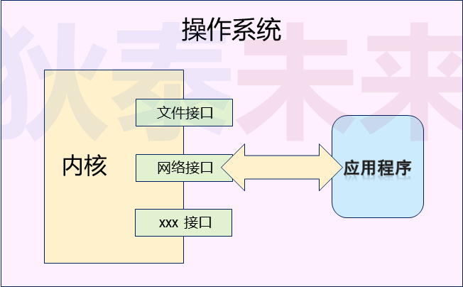

# (一) 网络编程核心概念与模式

# 1. 网络编程核心概念

❓问题 : 如何进行网络编程?

## 1.1 网络编程的本质

>- 使用操作系统提供的 **$\color{red}{接口函数}$** , 使得应用程序 **$\color{SkyBlue}{具备收发网络数据}$** 的能力
>
>
>
>- 网络接口在代码层面是操作系统提供的函数
>   - 网络编程只是一系列 **$\color{red}{系统函数的花式玩法}$**
>- 应用程序通过网络接口使用操作系统的联网能力
>   - 网络编程是 **$\color{SkyBlue}{特定领域的C语言程序设计}$**

## 1.2 网络编程核心概念

### 1.2.1 协议

>- 协议 : **$\color{SkyBlue}{为进行数据通信而预定义的数据规则}$**

### 1.2.2 地址

>- 地址 : 网络通信中的用于标识设备的 **$\color{red}{整数值}$** (分段的4字节整型数), 就是常说的 `IP` 地址。例如 (`192.168.1.254`)

### 1.2.3 端口号 

> - 设备为收发数据而 **$\color{red}{指定}$** 的数值 , 用于标识具体连接
> - 可理解为 : 设备中用于网络通信的数据通道。

### 1.2.4 角色

>- 服务端(server) : 等待连接的设备
>- 客户端(client) : 发起连接的设备
>
> 

## 1.3 网络连接实验

>
>
>
>
>
>
>

## 1.4 网络知识充电站

### 1.4.1 ❓网络就是 `IP` 地址吗 ? `URL` 是什么 , 域名又是什么 ?

>- **$\color{red}{网址不是}$** `IP` **$\color{red}{地址}$** , 是 **网络信息资源** 的地址 ( 如 : 具体网页的地址 ) 即 `URL` 。
>- **$\color{red}{域名}$** 是 `IP` 地址的 **$\color{red}{别名}$** , 多个域名可指向同一个 `IP` 地址。( 通过 `dns` 服务器转换 , 其实就是一个查询 )

### 1.4.2 ❓协议一定是看不懂的二进制数据吗 ?

>- **$\color{red}{协议是一种约定}$** , 即 : 预先定义的规则。
>- 协议可以基于 **文本** 定义 , 也可以基于 **二进制** 定义。

### 1.4.3 小端系统

> - 采用小端模式 (`little-endian`) 的系统 , 即 : 数据低字节放在内存低地址中。
>   - 例如 : 一个整型数据 (`int`) `0x12345678` (12是高字节 , 78是低字节)
>
> | low address |  78  |  56  |  34  |  12  | hight address |
> | :---------: | :--: | :--: | :--: | :--: | :-----------: |
>
> 

### 1.4.4 大端系统

> - 采用大端模式 (`big-endian`) 的系统 , 即 : 数据低字节放在内存高地址中
>   - 例如 : 一个整型数据 (`int`) `0x12345678` (12是高字节 , 78是低字节)
>
> | low address |  12  |  34  |  56  |  78  | hight address |
> | :---------: | :--: | :--: | :--: | :--: | :-----------: |

### 1.4.5 网络字节序

>- 网络字节顺序采用 **$\color{SkyBlue}{大端模式}$** , 所以 : **$\color{red}{在小端系统中需要做字节序转换}$**

❓问题 : 如何写代码复现这个网络连接实验

# 2. 网络编程核心模式

