# (十) TCP通信框架

❓问题 : 有了协议和协议解析器之后 , 可以干嘛?

# 1.客户端设计

## 1.1 概要设计图

>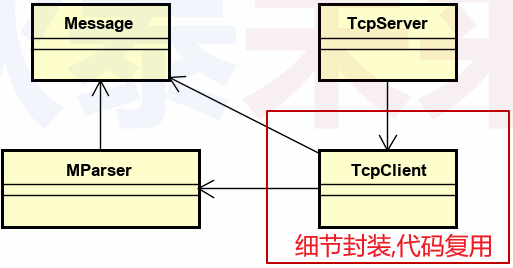

## 1.2 客户端

>- 以协议消息为基本单位收发数据
>- 同时支持字节为基本单位收发数据

## 1.3 服务端

>- 负责监听连接 , 并产生通信客户端
>- 负责监听数据通信状态 , 并给出通知

## 1.4 设计图

>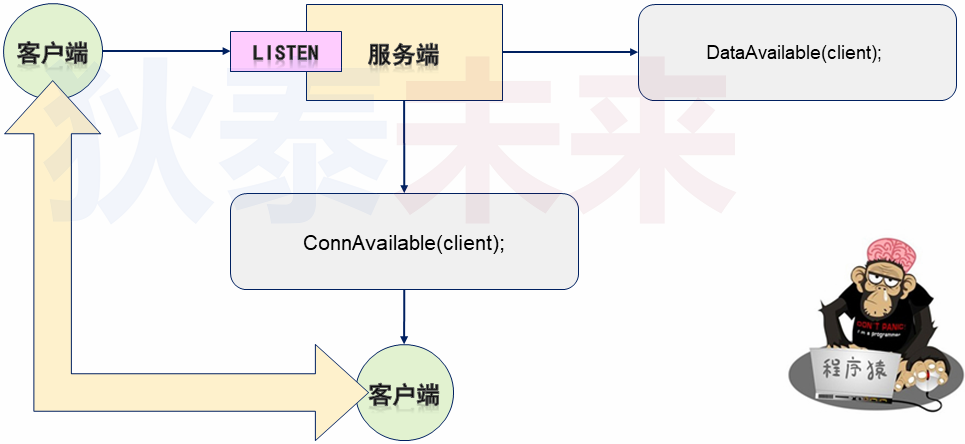

## 1.5 职责定义

>- 客户端用于进行实际的双向数据通信
>  - 数据发送 & 数据接收 (协议消息)
>- 服务端仅用于监听和回调通知
>  - 事件类型 : 连接 , 数据 , 断开
>  - 事件回调 : `void(*Listener)(TcpClient* client,int event)` 

## 1.6 客户端接口设计

>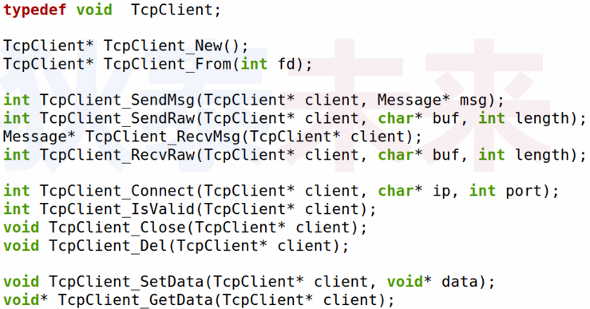

## 1.7 关键代码实现

>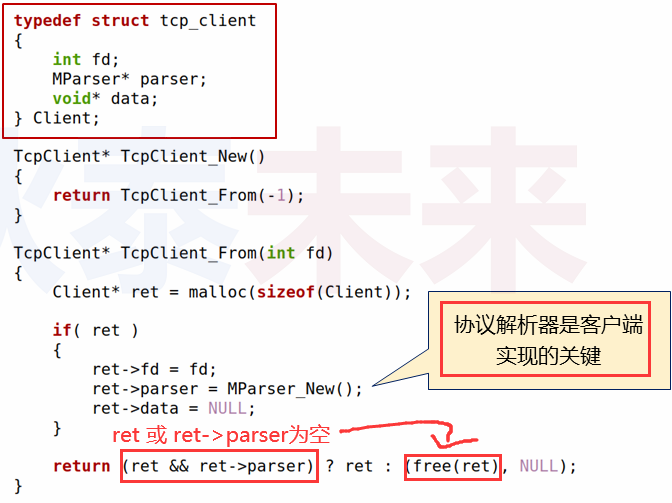
>
>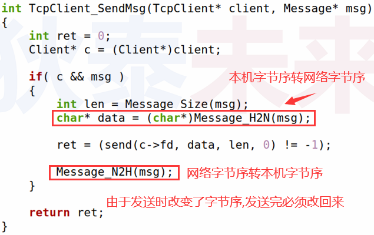

## 1.8 编程实验

[[参考链接]](https://github.com/WONGZEONJYU/STU_LINUX_NETWORK/tree/main/12.tcp_client_frame)

>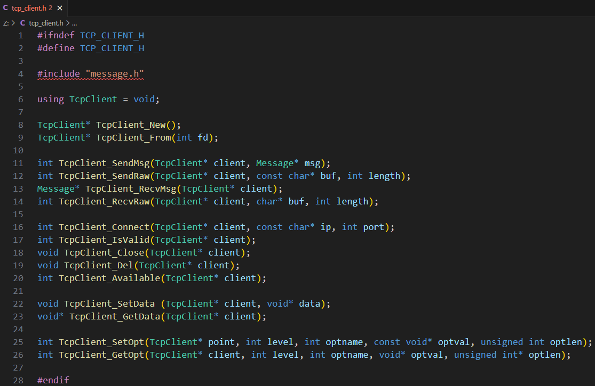
>
>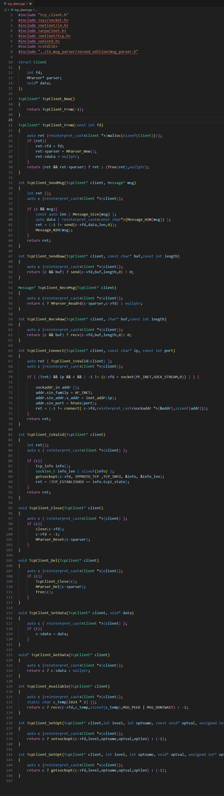
>
>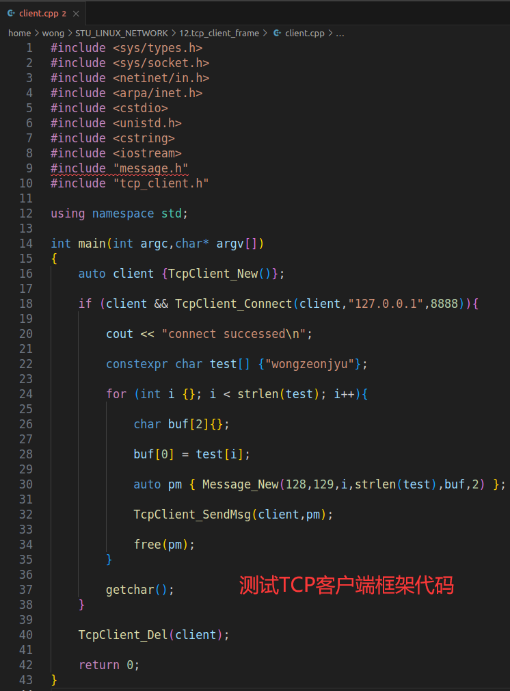
>
>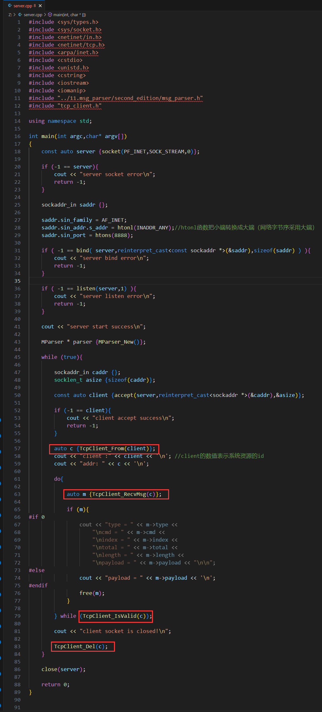
>
>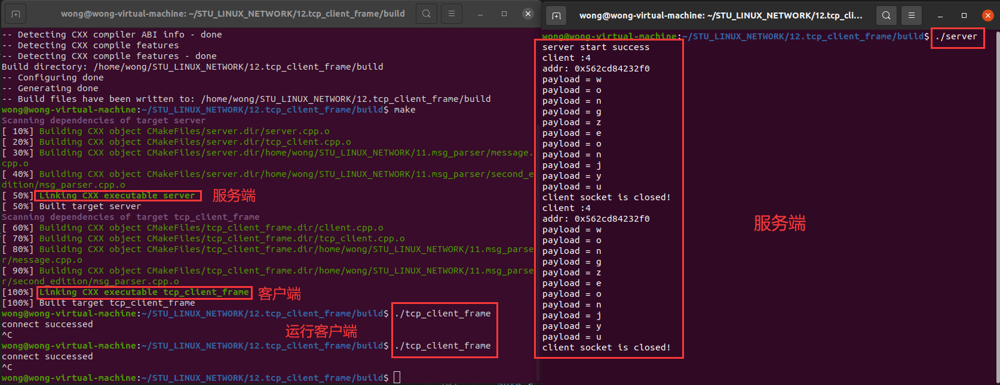
>
>```tex
>tips:
>在12.tcp_client_frame下
>mkdir build -> cd build -> cmake .. -> make
>生产tcp_client_frame 与 server
>```

❓思考 : 如何设计与客户端相对应的服务端 ?

# 2.服务端设计

❓思考 : 如何设计与客户端相对应的服务端 ?

## 2.1 概念设计图

>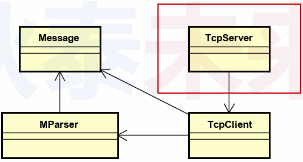

## 2.2 设计描述

>- 负责监听链接状态
>   - Connect : 产生通信客户端 ( `TcpClient` ) , 并给出事件通知
>   - Close : 给出事件通知 , 并销毁通信客户端
>- 负责监听数据通信状态 , 并给出事件通知

## 2.3 服务端事件设计

>- `EVT_CONN`
>   - 客户端连接服务端时触发 , 并创建 `TcpClient` 用于通信
>
>- `EVT_DATA`
>   - 客户端数据到达服务端时触发 , 使用 `TcpClient` 读取数据
>
>- `EVT_CLOSE`
>   - 客户端断开服务端时触发 , 相关 `TcpClient` 将被销毁
>
>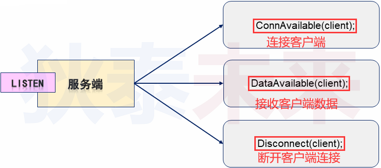
>
>❓问题 : 服务端如何知道什么时候进行事件回调通知 ?

## 2.4 循环机制

>- 服务端通过 `select` 机制循环触发事件回调
>
>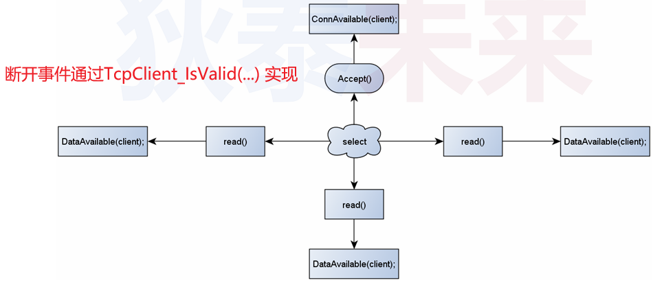

## 2.5 服务端接口设计

>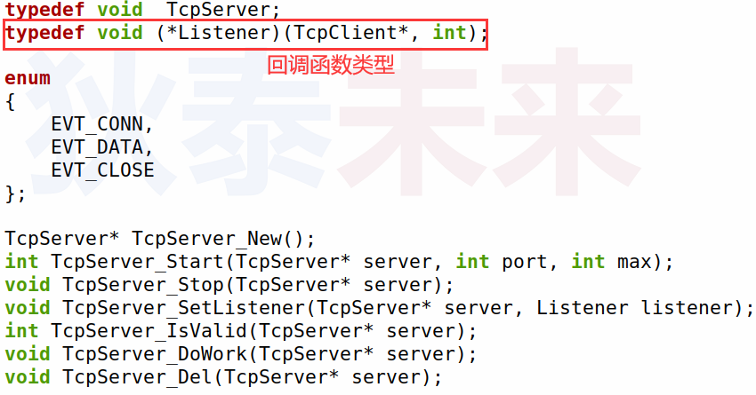

## 2.6 服务端关键代码实现

### 2.6.1 初始化

>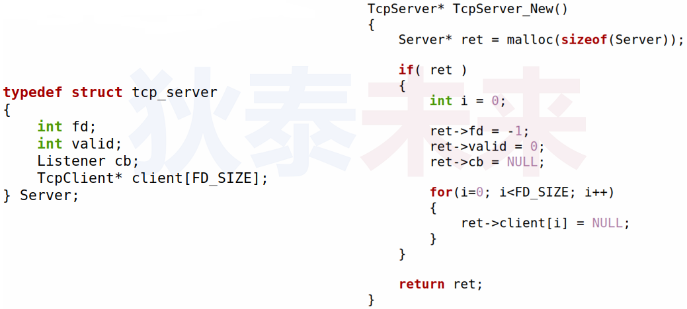

### 2.6.2 事件监听

>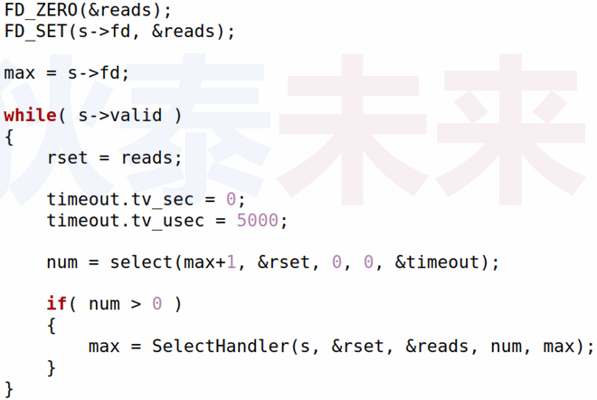

### 2.6.3 连接事件 & 数据事件

>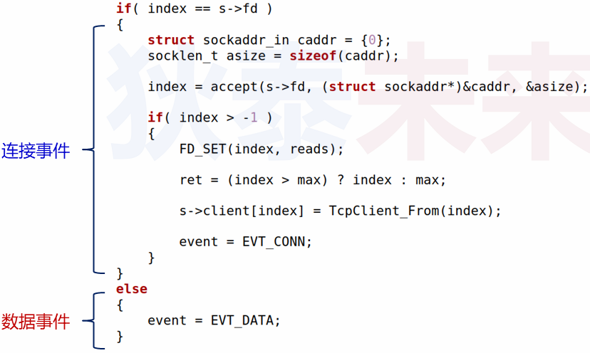

### 2.6.3 断开事件 & 事件通知

>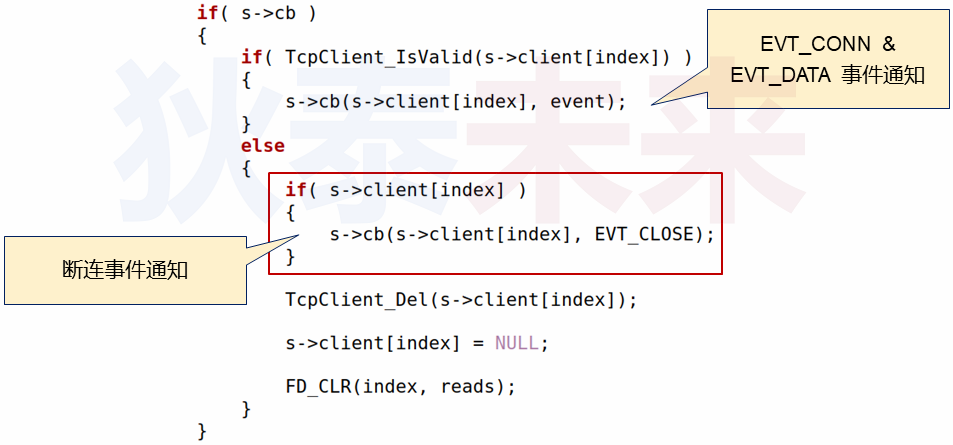

## 2.7 编程实验

[[]]()

>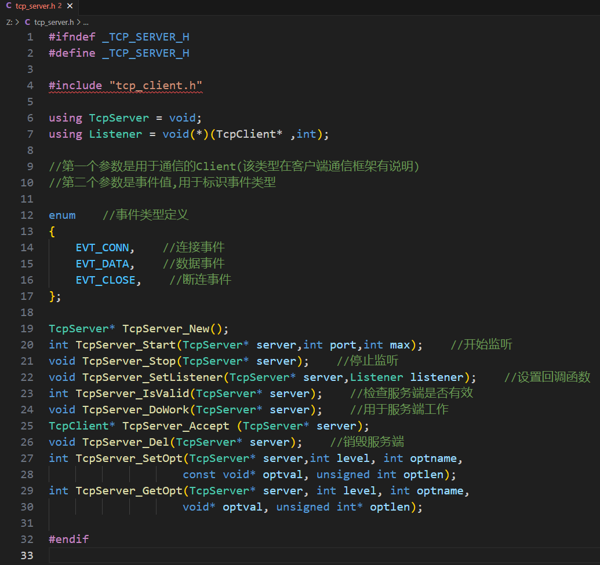
>
>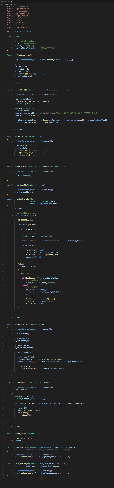

### 2.7.1 服务端单元测试

>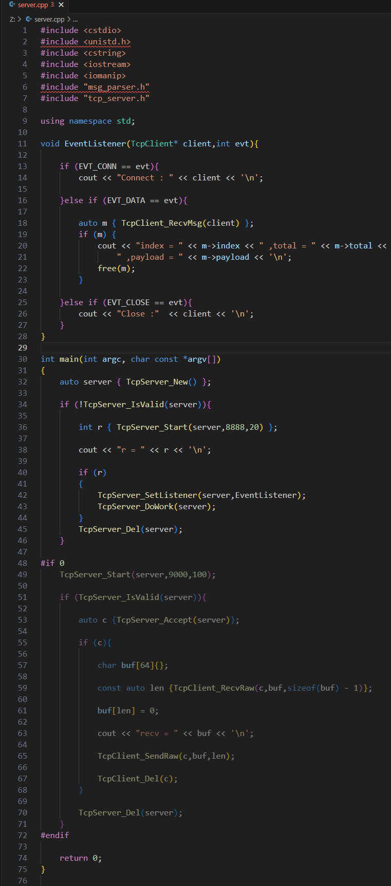
>
>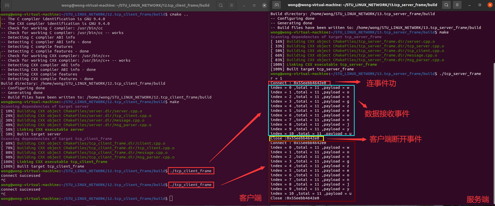
>
>```tex
>客户端代码在12.tcp_client_frame,编译过程请看客户端设计章节
>tips:
>编译过程:在13.tcp_server_frame
>mkdir build -> cd build -> cmake .. -> make
>生产可执行文件tcp_server_fram
>```

### 2.7.2 通信框架集成测试

>
>
>
