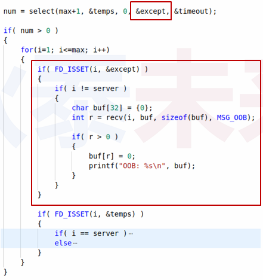
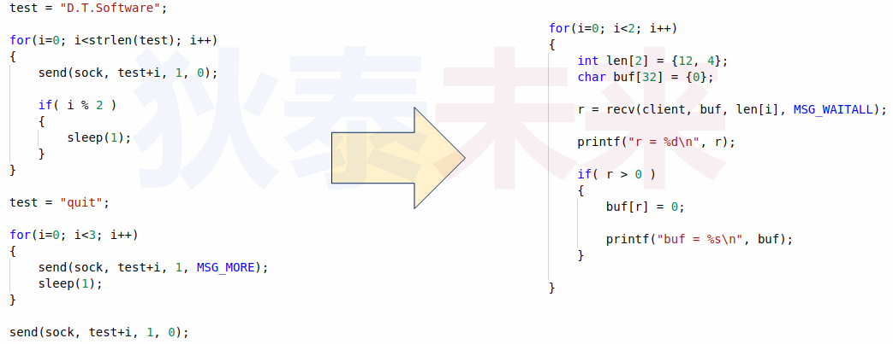

# (十一) 数据收发的扩展用法

>❓问题 : 
>
>`write(...)` 和 `send(...)` 都可以发送数据 , 有什么区别 ?
>
>`read(...)` 和 `recv(...)` 都可以接收数据 , 有什么区别 ?

# 1.数据收发选项

>```c++
>#include <sys/socket.h>
>ssize_t send(int sockfd,const void* buf,size_t nbytes,int flags);
>ssize_t recv(int sockfd,void *buf,size_t nbytes,int flags);
>/*flags----收发数据时指定的可选信息*/
>```

* ❓调用时flags参数的值为0 , 表示什么? 
	* 当 flags == 0 时 , `send(...) == write(...)` , `read(...) == recv(...)`
	* 表示默认网络数据收发的行为

# 2. `flags` 选项信息

 

# 3.`MSG_OOB` (带外数据 , 紧急数据)

* 原生定义
	* 使用与普通数据不同的通道独立传输的数据
	* 带外数据优先级比普通数据高 (优先传输 , 对端优先接收)
* TCP中的带外数据
	* 由于原生设计的限制 , TCP无法提供真正意义上带外数据
	* TCP中仅能通过传输协议消息头中的标记

## 3.1 TCP带外数据实现原理

 

## 3.2 TCP带外数据处理策略

* 由于 TCP 设计为流式数据 , 因此 , 无法做到真正的带外数据
* 被标记的紧急数据可被提前接收 , 进入 **$\color{red}{特殊缓冲区}$**  (仅 1字节)
	* 每个TCP 包最多只有一个紧急数据
	* 特殊缓冲区仅存放最近的紧急数据 (不及时接收将丟失)

* 用下面的方式收发数据
	* 发送普通数据 , 普通方式接收 : 数据按需到达
	* 发送普通数据 , 紧急方式接收 : 什么都收不到 (特殊缓冲区没有数据) , 错误返回
	* 发送紧急数据 , 普通方式接收 : 数据进入特殊缓冲区 , 普通接收只能一直在等待
	*  发送紧急数据 , 紧急方式接收 : 收到紧急数据

## 3.3 实验 (演示紧急数据收发)

[[参考链接]](https://github.com/WONGZEONJYU/STU_LINUX_NETWORK/tree/main/14.flags_parameter/msg_oob)

### 3.3.1 client

>```c++
>#include <sys/types.h>
>#include <sys/socket.h>
>#include <netinet/in.h>
>#include <arpa/inet.h>
>#include <cstdio>
>#include <unistd.h>
>#include <cstring>
>#include <iostream>
>
>using namespace std;
>
>int main(int argc,char* argv[])
>{
>    int sock{socket(PF_INET,SOCK_STREAM,0)};
>
>    if (-1 == sock){
>        cout << "socket error\n";
>        return -1;
>    }
>
>    sockaddr_in addr {};
>    addr.sin_family = AF_INET;
>    addr.sin_addr.s_addr = inet_addr("127.0.0.1");
>    addr.sin_port = htons(8888);
>
>    if ( -1 == connect( sock,reinterpret_cast<sockaddr *>(&addr),sizeof(addr) )){
>        cout << "connect error\n";
>        return -1;
>    }
>
>    cout << "connect success sock :" << sock << '\n';
>
>    constexpr char test[] {"urgent_data"};
>
>    const int len (send(sock,test,strlen(test),MSG_OOB));/*发送紧急数据*/
>
>    getchar();
>
>    close(sock);
>
>    return 0;
>}
>
>```

### 3.3.2 server

>```c++
>#include <sys/types.h>
>#include <sys/socket.h>
>#include <netinet/in.h>
>#include <arpa/inet.h>
>#include <cstdio>
>#include <unistd.h>
>#include <cstring>
>#include <iostream>
>
>using namespace std;
>
>int main(int argc,char* argv[])
>{
>    int server {socket(PF_INET,SOCK_STREAM,0)};
>
>    if (-1 == server){
>        cout << "server socket error\n";
>        return -1;
>    }
>
>    sockaddr_in saddr {};
>    saddr.sin_family = AF_INET;
>    saddr.sin_addr.s_addr = htonl(INADDR_ANY);//htonl函数把小端转换成大端（网络字节序采用大端）
>    saddr.sin_port = htons(8888);
>
>    if ( -1 == bind( server,reinterpret_cast<const sockaddr *>(&saddr),sizeof(saddr) ) ){
>        cout << "server bind error\n";
>        return -1;
>    }
>
>    if ( -1 == listen(server,1) ){
>        cout << "server listen error\n";
>        return -1;
>    }
>
>    cout << "server start success\n";
>
>    for(;;){
>
>        sockaddr_in caddr {};
>        socklen_t asize {sizeof(caddr)};
>
>        const int client {accept(server,reinterpret_cast<sockaddr *>(&caddr),&asize)};
>
>        if (-1 == client){
>            cout << "client accept error\n";
>            return -1;
>        }
>
>        cout << "client :" << client << '\n'; //client的数值表示系统资源的id
>
>        int r{},len{};
>
>        do{
>            char buf[32]{};
>
>            r = recv(client,buf,sizeof(buf),MSG_OOB);/*紧急数据接收*/
>
>            if (r > 0){
>                buf[r] = 0;
>                cout << "OOB : " << buf << '\n';
>            }
>
>            r = recv(client,buf,sizeof(buf),0); /*普通数据收发*/
>
>            if (r > 0){
>                buf[r] = 0;
>                cout << "DATA : " << buf << '\n';
>            }
>
>        } while (r > 0);
>
>        close(client);
>    }
>
>    close(server);
>
>    return 0;
>}
>
>
>```

 

>```tex
>以上服务端写法存在一个问题:
>紧急数据并非马上能收到,因为紧急数据接收 与普通数据接收轮流交替执行
>当服务端没收到紧急数据就会返回-1,此时程序就跳到正常数据收发,并阻塞等待
>当客户端发送的数据带有紧急数据 , 那么服务端给我们一个假象就是先收到了普通数据 , 
>再收到紧急数据
>```

## 3.4 高效接收紧急数据

> ❓实际开发中 , 如何高效的接收TCP紧急数据 ?

### 3.4.1 使用select接收紧急数据

* socket上收到 普通数据 和 紧急数据 时都会使得 `select(...)` 立即返回
	* 普通数据 : socket处于数据可读状态 (可读取普通数据)
	* 紧急数据 : sock处理 **$\color{red}{异常状态}$** (可读取紧急数据)

### 3.4.2 紧急数据接收示例

 

### 3.4.3 实验 (高效收发紧急数据)

[[参考链接]](https://github.com/WONGZEONJYU/STU_LINUX_NETWORK/tree/main/14.flags_parameter/msg_oob)

#### 3.4.3.1 client

>```c++
>#include <sys/types.h>
>#include <sys/socket.h>
>#include <netinet/in.h>
>#include <arpa/inet.h>
>#include <cstdio>
>#include <unistd.h>
>#include <cstring>
>#include <iostream>
>
>using namespace std;
>
>int main(int argc,char* argv[])
>{
>    int sock{socket(PF_INET,SOCK_STREAM,0)};
>
>    if (-1 == sock){
>        cout << "socket error\n";
>        return -1;
>    }
>
>    sockaddr_in addr {};
>    addr.sin_family = AF_INET;
>    addr.sin_addr.s_addr = inet_addr("127.0.0.1");
>    addr.sin_port = htons(8888);
>
>    if ( -1 == connect( sock,reinterpret_cast<sockaddr *>(&addr),sizeof(addr) )){
>        cout << "connect error\n";
>        return -1;
>    }
>
>    cout << "connect success sock :" << sock << '\n';
>
>    constexpr char test[] {"urgent_data"};
>
>    const int len (send(sock,test,strlen(test),MSG_OOB)); /*发送紧急数据*/
>
>    getchar();
>
>    close(sock);
>
>    return 0;
>}
>
>```

#### 3.4.3.2 server

>```c++
>#include <sys/types.h>
>#include <sys/socket.h>
>#include <sys/select.h>
>#include <netinet/in.h>
>#include <arpa/inet.h>
>#include <cstdio>
>#include <unistd.h>
>#include <cstring>
>#include <iostream>
>
>using namespace std;
>
>int server_handler(int server)
>{
>    sockaddr_in addr{};
>    socklen_t asize {sizeof(addr)};
>    return accept(server,reinterpret_cast<sockaddr *>(&addr),&asize);
>}
>
>int client_handler(int client)
>{
>    char buf[32]{};
>    //int ret ( read(client,reinterpret_cast<void *>(buf),(sizeof(buf) - 1)) );
>    auto ret { recv(client,buf,(sizeof(buf) - 1),0) };
>
>    if (ret > 0){
>        buf[ret] = 0;
>        cout << "Receive :" << buf << '\n';
>        ret = strcmp(buf,"quit") ? write(client,buf,ret) : -1 ;
>    }
>
>    return ret;
>}
>
>int main(int argc,char* argv[])
>{
>    const int server {socket(PF_INET,SOCK_STREAM,0)};
>
>    if (-1 == server){
>        cout << "server socket error\n";
>        return -1;
>    }
>
>    sockaddr_in saddr {};
>
>    saddr.sin_family = AF_INET;
>    saddr.sin_addr.s_addr = htonl(INADDR_ANY);//htonl函数把小端转换成大端（网络字节序采用大端）
>    saddr.sin_port = htons(8888);
>
>    if ( -1 == bind( server,reinterpret_cast<const sockaddr *>(&saddr),sizeof(saddr) ) ){
>        cout << "server bind error\n";
>        return -1;
>    }
>
>    if ( -1 == listen(server,1) ){
>        cout << "server listen error\n";
>        return -1;
>    }
>
>    cout << "server start success\n" << 
>            "server socket_fd :" << server << '\n';
>
>    int max{server};
>    fd_set reads{};
>
>    FD_ZERO(&reads);
>    FD_SET(server,&reads);
>    
>    for(;;) {
>
>        fd_set temps { reads };
>        fd_set except{ reads };
>        timeval timeout{ .tv_sec = 0,.tv_usec = 10000 };
>
>        const int num { select((max + 1),&temps,nullptr,&except,&timeout) };
>
>        if (num > 0){
>
>            for (int i {server}; i <= max; i++) {
>
>                if (FD_ISSET(i,&except)){ /*通过判断异常去接收紧急数据*/
>                    
>                    if (i != server) {
>
>                        char buf[2]{};
>                        const auto r {recv(i,buf,sizeof(buf),MSG_OOB)}; /*紧急数据接收*/
>                        if (r > 0){
>                            buf[r] = 0;
>                            cout << "OOB : "<< buf << '\n';
>                        }
>                    }
>                }
>
>                if (FD_ISSET(i,&temps)){
>
>                    if (i == server) {
>                        const int client {server_handler(server)};
>                        if( client > -1 ){
>                            FD_SET(client,&reads);
>                            max = ((client > max) ? client : max);
>
>                            cout << "accept client:" << client <<
>                                    "\nmax:" << max << 
>                                    "\nserver :" << server << '\n';
>                        }
>                    } else{
>                        const int r { client_handler(i) };
>                        if (-1 == r){
>                            FD_CLR(i,&reads);
>                            close(i);
>                        }
>                    }
>                }
>            }
>        }
>    }
>
>    close(server);
>    return 0;
>}
>```

 

## 3.5小结论

* `read(...)` 和 `write(...)` 可用于收发普通数据 (不具备扩展功能)
* `send(...)` 和 `recv(...)` 可通过选项信息扩展更多功能
* TCP紧急数据可标识 **$\color{red}{256}$** 种紧急事件 (异常事件)
* 通过select能够及时处理紧急数据 , 并区分普通数据

# 4. `MSG_PEEK` (数据窥探)

* 使用 `MSG_PEEK` 选项能够获取接收缓冲区数据的拷贝
	* `recv(...)` 专用选项 , 可用于数据预接收
	* 指定 `MSG_PEEK` 选项时 , **$\color{red}{不会清空缓冲区}$**可
	* 用于获取接收缓冲区中的数据量 (字节数)

 

## 4.1 实验

[[参考代码]](https://github.com/WONGZEONJYU/STU_LINUX_NETWORK/tree/main/14.flags_parameter/msg_peek)

### 4.1.1 client

>```c++
>#include <sys/types.h>
>#include <sys/socket.h>
>#include <netinet/in.h>
>#include <arpa/inet.h>
>#include <cstdio>
>#include <unistd.h>
>#include <cstring>
>#include <iostream>
>
>using namespace std;
>
>int main(int argc,char* argv[])
>{
>    const int sock {socket(PF_INET,SOCK_STREAM,0)};
>
>    if (-1 == sock){
>        cout << "socket error\n";
>        return -1;
>    }
>
>    sockaddr_in addr {};
>    addr.sin_family = AF_INET;
>    addr.sin_addr.s_addr = inet_addr("127.0.0.1");
>    addr.sin_port = htons(8888);
>
>    if ( -1 == connect( sock,reinterpret_cast<sockaddr *>(&addr),sizeof(addr) )){
>        cout << "connect error\n";
>        return -1;
>    }
>
>    cout << "connect success sock :" << sock << '\n';
>
>    sleep(2);
>
>    constexpr char test[] {"hello_world"};
>    const auto len {send(sock,test,strlen(test),0)};
>    getchar();
>    close(sock);
>    return 0;
>}
>```

### 4.1.2 server

>```c++
>#include <sys/types.h>
>#include <sys/socket.h>
>#include <netinet/in.h>
>#include <arpa/inet.h>
>#include <cstdio>
>#include <unistd.h>
>#include <cstring>
>#include <iostream>
>
>using namespace std;
>
>int main(int argc,char* argv[])
>{
>    const int server {socket(PF_INET,SOCK_STREAM,0)};
>
>    if (-1 == server){
>        cout << "server socket error\n";
>        return -1;
>    }
>
>    sockaddr_in saddr {};
>
>    saddr.sin_family = AF_INET;
>    saddr.sin_addr.s_addr = htonl(INADDR_ANY);//htonl函数把小端转换成大端（网络字节序采用大端）
>    saddr.sin_port = htons(8888);
>
>    if ( -1 == bind( server,reinterpret_cast<const sockaddr *>(&saddr),sizeof(saddr) ) ){
>        cout << "server bind error\n";
>        return -1;
>    }
>
>    if ( -1 == listen(server,1) ){
>        cout << "server listen error\n";
>        return -1;
>    }
>
>    cout << "server start success\n";
>
>    for(;;){
>
>        sockaddr_in caddr {};
>        socklen_t asize {sizeof(caddr)};
>
>        const int client {accept(server,reinterpret_cast<sockaddr *>(&caddr),&asize)};
>
>        if (-1 == client){
>            cout << "client accept error\n";
>            return -1;
>        }
>
>        cout << "client :" << client << '\n'; //client的数值表示系统资源的id
>
>        int r {},len{};
>
>        do{
>            char buf[32]{};
>
>            r = recv(client,buf,sizeof(buf),MSG_PEEK);
>
>            if (r > 0){
>
>                buf[r] = 0;
>                cout << "r = "<< r << 
>                    "\ndata : " << buf << '\n';
>
>                r = recv(client,buf,sizeof(buf),0);
>
>                buf[r] = 0;
>                cout << "r = "<< r << 
>                    "\ndata : " << buf << '\n';
>            }else{
>                cout << "no data in receive buf\n";
>            }
>
>        } while (r > 0);
>
>        close(client);
>    }
>
>    close(server);
>    return 0;
>}
>
>```

 

>```c++
>屏蔽掉正常接收代码
>```

 

 

# 5. `MSG_DONTWAIT` (立即收发模式)

* 数据收发时不阻塞 , 立即返回
	* `send(...)` : 如果无法将数据送入发送缓冲区，那么直接错误返回
	* `recv(...)` : 如果接收缓冲区中没有数据，那么直接错误返回
* `send(...)` / `recv(...)` 返回值 :
	* -1 -> 错误发生
	* 0 -> 对端调用 `close(...)` 关闭连接
	* n -> 发送 / 接收的数据量

 

## 5.1 实验

[[参考代码]](https://github.com/WONGZEONJYU/STU_LINUX_NETWORK/tree/main/14.flags_parameter/msg_dontwait)

### 5.1.1. client

>```c++
>#include <sys/types.h>
>#include <sys/socket.h>
>#include <netinet/in.h>
>#include <arpa/inet.h>
>#include <cstdio>
>#include <unistd.h>
>#include <cstring>
>#include <iostream>
>
>using namespace std;
>
>int main(int argc,char* argv[]) 
>{
>    int sock{socket(PF_INET,SOCK_STREAM,0)};
>
>    if (-1 == sock){
>        cout << "socket error\n";
>        return -1;
>    }
>
>    sockaddr_in addr {};
>    addr.sin_family = AF_INET;
>    addr.sin_addr.s_addr = inet_addr("127.0.0.1");
>    addr.sin_port = htons(8888);
>
>    if ( -1 == connect( sock,reinterpret_cast<sockaddr *>(&addr),sizeof(addr) )){
>        cout << "connect error\n";
>        return -1;
>    }
>
>    cout << "connect success sock :" << sock << '\n';
>
>    sleep(1);
>
>    const char* test {"hello_world"};
>
>    int len (send(sock,test,strlen(test),0));
>
>    sleep(1);
>
>    test = "quit";
>
>    len = send(sock,test,strlen(test),0);
>
>    getchar();
>
>    close(sock);
>
>    return 0;
>}
>
>```

### 5.1.2 server

>```c++
>#include <sys/types.h>
>#include <sys/socket.h>
>#include <netinet/in.h>
>#include <arpa/inet.h>
>#include <cstdio>
>#include <unistd.h>
>#include <cstring>
>#include <iostream>
>
>using namespace std;
>
>int main(int argc,char* argv[])
>{
>    int server {socket(PF_INET,SOCK_STREAM,0)};
>
>    if (-1 == server){
>        cout << "server socket error\n";
>        return -1;
>    }
>
>    sockaddr_in saddr {};
>
>    saddr.sin_family = AF_INET;
>    saddr.sin_addr.s_addr = htonl(INADDR_ANY);//htonl函数把小端转换成大端（网络字节序采用大端）
>    saddr.sin_port = htons(8888);
>
>    if ( -1 == bind( server,reinterpret_cast<const sockaddr *>(&saddr),sizeof(saddr) ) ){
>        cout << "server bind error\n";
>        return -1;
>    }
>
>    if ( -1 == listen(server,1) ){
>        cout << "server listen error\n";
>        return -1;
>    }
>
>    cout << "server start success\n";
>
>    while (true){
>
>        sockaddr_in caddr {};
>        socklen_t asize {sizeof(caddr)};
>
>        int client { accept(server,reinterpret_cast<sockaddr *>(&caddr),&asize) };
>
>        if (-1 == client){
>            cout << "client accept error\n";
>            return -1;
>        }
>
>        cout << "client :" << client << '\n'; //client的数值表示系统资源的id
>        int r {},len{};
>
>        do{
>            char buf[32]{};
>            r = recv(client,buf,sizeof(buf),MSG_DONTWAIT);
>
>            if (r > 0){
>                buf[r] = 0;
>                cout << "r = "<< r <<
>                    "\ndata : " << buf << '\n';
>                if (0 == strcmp(buf,"quit") ){
>                    break;
>                }
>            }else{
>                cout << "no data in receive buf\n";
>                sleep(1);
>            }
>        } while (true);
>        close(client);
>    }
>    close(server);
>    return 0;
>}
>
>```

 

# 6.再论阻塞

## 6.1 阻塞发送模式

* `send(...)`
	* 发送数据长度 ＞发送缓冲区长度 -->返回错误
	* 发送数据长度 <= 发送缓冲区剩余长度 --> 复制数据到发送缓冲区
	* 发送缓冲区剩余长度 ＜ 发送数据长度 <= 发送缓冲区长度 --> 等待发送缓冲区清空
* `recv(...)`
	* 接收缓冲区中没有数据时 --> 等待数据
	* 接收缓冲区数据量 <= 接收区长度 --> 数据全部拷贝到接收区
	* 接收缓冲区数据量 > 接收区长度 --> 拷贝部分数据到接收区

# 7. 通信框架的迭代增强

 

 

# 8.等待数据 &  更多数据

* `MSG_WAITALL` : **接收专用** , 等待需要的数据量完全满足时 , `recv(...)` 才返回
* `MSG_MORE` : **发送专用** , 指示内核不着急将发送缓冲区中的数据进行传输

 

## 8.1 实验

[[参考代码]](https://github.com/WONGZEONJYU/STU_LINUX_NETWORK/tree/main/14.flags_parameter/msg_waitall)

### 8.1.1 client

>```c++
>#include <sys/types.h>
>#include <sys/socket.h>
>#include <netinet/in.h>
>#include <arpa/inet.h>
>#include <cstdio>
>#include <unistd.h>
>#include <cstring>
>#include <iostream>
>
>using namespace std;
>
>int main(int argc, char const *argv[])
>{
>    int sock{socket(PF_INET,SOCK_STREAM,0)};
>
>    if (-1 == sock){
>        cout << "socket error\n";
>        return -1;
>    }
>
>    sockaddr_in addr {};
>    addr.sin_family = AF_INET;
>    addr.sin_addr.s_addr = inet_addr("127.0.0.1");
>    addr.sin_port = htons(8888);
>
>    if ( -1 == connect( sock,reinterpret_cast<sockaddr *>(&addr),sizeof(addr) )){
>        cout << "connect error\n";
>        return -1;
>    }
>
>    cout << "connect success sock :" << sock << '\n';
>
>    const char * test {"helloworld"};
>
>    for (int i {}; i < strlen(test); i++){
>        send(sock,(test + i),1,0);
>        if (i % 2){
>            sleep(1);
>        }
>    }
>
>    test = "quit";
>
>    int i {};
>    for (; i < (strlen(test) - 1); i++){
>        send(sock,(test + i),1,MSG_MORE);
>        sleep(1);
>    }
>
>    send(sock,test + i,1,0);
>    getchar();
>    close(sock);
>
>    return 0;
>}
>
>```

### 8.1.2 server

>```c++
>#include <sys/types.h>
>#include <sys/socket.h>
>#include <netinet/in.h>
>#include <arpa/inet.h>
>#include <cstdio>
>#include <unistd.h>
>#include <cstring>
>#include <iostream>
>
>using namespace std;
>
>int main(int argc, char const *argv[])
>{
>    const int server {socket(PF_INET,SOCK_STREAM,0)};
>
>    if (-1 == server){
>        cout << "server socket error\n";
>        return -1;
>    }
>
>    sockaddr_in saddr {};
>
>    saddr.sin_family = AF_INET;
>    saddr.sin_addr.s_addr = htonl(INADDR_ANY);//htonl函数把小端转换成大端（网络字节序采用大端）
>    saddr.sin_port = htons(8888);
>
>    if ( -1 == bind( server,reinterpret_cast<const sockaddr *>(&saddr),sizeof(saddr) ) ){
>        cout << "server bind error\n";
>        return -1;
>    }
>
>    if ( -1 == listen(server,1) ){
>        cout << "server listen error\n";
>        return -1;
>    }
>
>    cout << "server start success\n";
>
>    
>    while (true){
>
>        sockaddr_in caddr {};
>        socklen_t asize {sizeof(caddr)};
>
>        int client {accept(server,reinterpret_cast<sockaddr *>(&caddr),&asize)};
>
>        if (-1 == client){
>            cout << "client accept error\n";
>            return -1;
>        }
>
>        cout << "client :" << client << '\n'; //client的数值表示系统资源的id
>
>        do{
>
>            for (int i {}; i < 2; i++){
>
>                constexpr int len[] {10,4};
>                char buf[32]{};
>
>                const auto r {recv(client,buf,len[i],MSG_WAITALL)};
>
>                if (r > 0){
>
>                    buf[r] = 0;
>                    cout << "buf = " << buf << '\n';
>
>                    if (0 == strcmp(buf,"quit")){
>                        break;
>                    }
>                }
>            }
>
>        } while (false);
>
>        close(client);
>    }
>
>    close(server);
>    return 0;
>}
>
>```

 

>❓思考 : 如何使用 UDP 进行数据收发 ?
