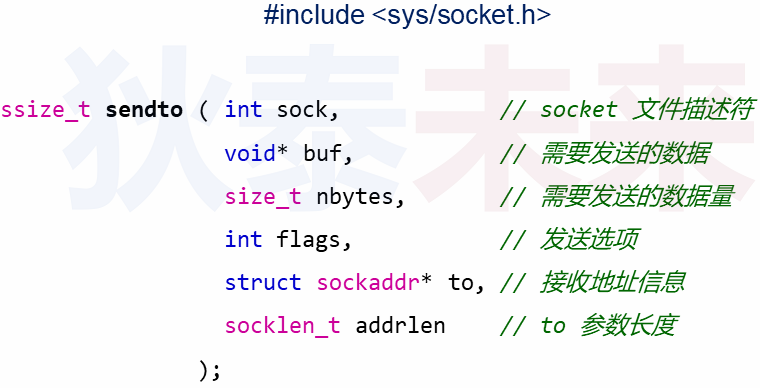
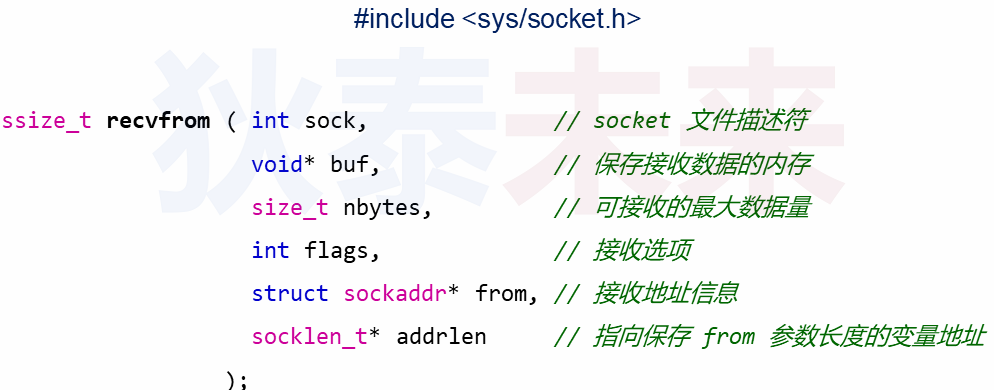
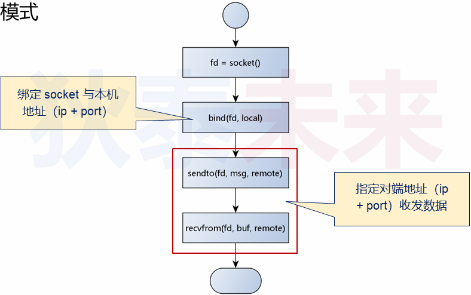
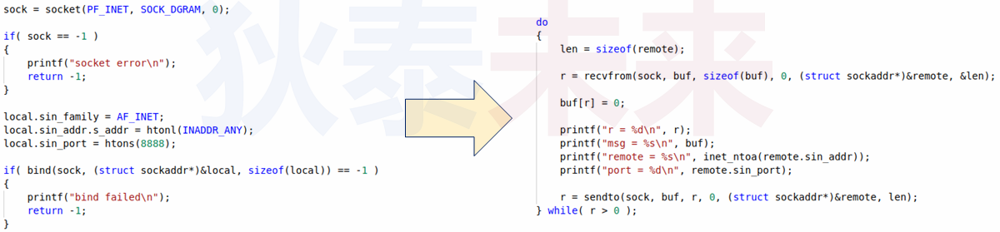
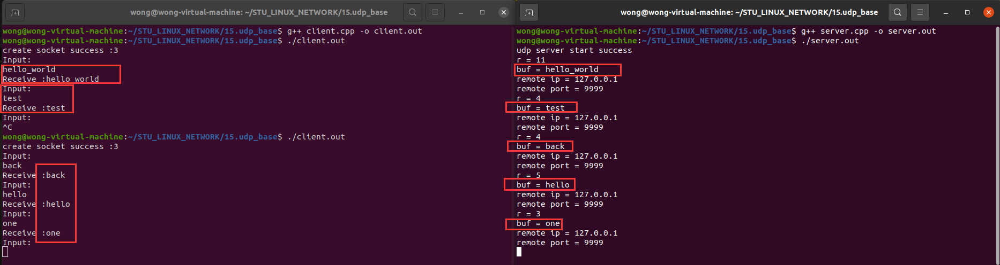

# 十二、`UDP` 数据收发

❓问题 : 如何使用 `UDP` 进行数据收发 ?

# 1.再论 `UDP` 协议

>- `UDP` 是无连接的 (不可靠 , 无应答消息 , 数据包无序号标识)
>- `UDP` 是面向数据包 , 对应用层数据既不合并也不拆分 (保留数据包边界)
>- `UDP` 没有拥塞控制 , 网络出现的拥塞不会使源主机得发送速率降低
>- `UDP` 支持一对一、一对多、多对一和多对多的交互通信
>- `UDP` 消息头开销小 , 只有8个字节 (TCP消息头共20个字节)
>
>

# 2. `UDP` 和 `IP` 的区别

>- `UDP` 是建立于 `IP`之上的数据传输协议
>   - `IP` 负责将 `UDP` 数据包从源主机传输到目标主机
>   - `UDP` 将应用层数据投递到目标 `socket` (端口号)
>- `UDP` 几乎完整 "继承" 了 `IP` 传输的特性
>   - 通信两端无交互 , 无流控 , 无超时重发 , 不具备可靠性
>- `UDP` 是 `IP` 层的一个轻度定制，而 `TCP` 是 `IP` 层的深度定制
>

# 3. `UDP` 数据收发

>
>
>

# 4. `UDP` 编程模式

>

# 5.`UDP` 数据收发

>

# 6. 实验

[[参考代码]](https://github.com/WONGZEONJYU/STU_LINUX_NETWORK/tree/main/15.udp_base)

>1. client
>
>```c++
>#include <sys/types.h>
>#include <sys/socket.h>
>#include <netinet/in.h>
>#include <arpa/inet.h>
>#include <cstdio>
>#include <unistd.h>
>#include <cstring>
>#include <iostream>
>
>using namespace std;
>
>int main(int argc, char* argv[])
>{
>    const int sock{socket(PF_INET,SOCK_DGRAM,0)};
>
>    if (-1 == sock){
>        cout << "socket error\n";
>        return -1;
>    }
>
>    cout << "create socket success :" << sock << '\n';
>
>    sockaddr_in local {};
>    local.sin_family = AF_INET;
>    local.sin_addr.s_addr = htonl(INADDR_ANY);
>    local.sin_port = htons(9999);
>
>    if ( -1 == bind( sock,reinterpret_cast<const sockaddr *>(&local),sizeof(local) ) ){
>        cout << "udp bind error\n";
>        return -1;
>    }
>
>    for(;;) {
>
>        char input[32]{},buf[128]{};
>        sockaddr_in remote {};
>        remote.sin_family = AF_INET;
>        remote.sin_addr.s_addr = inet_addr("127.0.0.1");
>        remote.sin_port = htons(8888);
>
>        cout << "Input: \n";
>        cin >> input;
>
>        socklen_t len {sizeof(remote)};
>        sendto(sock,input,strlen(input),0,reinterpret_cast<const sockaddr * >(&remote),len);
>        const auto r { recvfrom(sock,buf,sizeof(buf),0,reinterpret_cast<sockaddr * >(&remote),&len) };
>
>        if (r > 0){
>            buf[r] = 0;
>            cout << "Receive :" << buf << '\n';
>            if(0 == strcmp(buf,"quit")){
>                break;
>            }
>        }else{
>            break;
>        }
>    }
>
>    close(sock);
>    return 0;
>}
>
>```
>
>2. server
>
>```c++
>#include <sys/types.h>
>#include <sys/socket.h>
>#include <netinet/in.h>
>#include <arpa/inet.h>
>#include <cstdio>
>#include <unistd.h>
>#include <cstring>
>#include <iostream>
>
>using namespace std;
>
>int main(int argc, char* argv[])
>{
>    int server {socket(PF_INET,SOCK_DGRAM,0)};
>
>    if (-1 == server){
>        cout << "server socket error" << endl;
>        return -1;
>    }
>
>    sockaddr_in saddr {};
>    saddr.sin_family = AF_INET;
>    saddr.sin_addr.s_addr = htonl(INADDR_ANY);//htonl函数把小端转换成大端（网络字节序采用大端）
>    saddr.sin_port = htons(8888);
>
>    if ( -1 == bind( server,reinterpret_cast<const sockaddr *>(&saddr),sizeof(saddr) ) ){
>        cout << "udp server bind error\n";
>        return -1;
>    }
>
>    cout << "udp server start success\n";
>
>    for(;;){
>
>        sockaddr_in remote {};
>        socklen_t len {sizeof(remote)};
>        char buf[128]{};
>        const auto r {recvfrom(server,buf,sizeof(buf),0,reinterpret_cast<sockaddr* >(&remote),&len)};
>
>        buf[r] = 0;
>
>        cout << "r = " << r << 
>            "\nbuf = " << buf << 
>            "\nremote ip = " << inet_ntoa(remote.sin_addr) << 
>            "\nremote port = " << ntohs(remote.sin_port) << '\n';
>
>        sendto(server,buf,r,0,reinterpret_cast<const sockaddr * >(&remote),len);
>    }
>
>    close(server);
>    return 0;
>}
>
>```
>
>

❓思考 : 如何进行一对多的 `UDP` 数据发送 ?

