# 十三 、深入 `UDP` 数据收发

❓问题 : 如何进行一对多的 `UDP` 数据收发 ?

# 1.广播

## 1.1 `UDP` 通信中的广播

>- 广播是向同一网络中的所有主机传输数据的方法
>- 广播类型
>   - 直接广播 : IP 地址中除网络地址外，其余主机地址均设置为1 (exp : 192.168.1.255)
>     - 普遍局域网都是采用c类地址,前3个字节都是网络地址(例:192.168.1.xxx),最后一个字节是主机地址
>   - 本地广播 : 无需知道网络地址 , 使用255.255.255.255作为 IP 地址使用
>- 区别 : 
>   - 本地广播数据不经过路由器寻址 , 直接发送到本地主机
>

## 1.2 本地广播应用案例 (`DHCP`)

>- DHCP ( **动态主机配置协议** ) 是一个局域网的网络协议 ( **基于UDP协议** )
>   - 本地主机可自动获得服务器分配的 IP 地址和子网掩码
>
>- `DHCP` 采用客户端/服务端 (C/S) 模型 , 地址的动态分配由网络主机驱动
>- 工作方式 :
>   - 当 `DHCP` 服务器接收到来自网络主机的地址申请时 , 会向网络主机发送相关的地址配置信息 , 以实现网络机地址信息的动态配置
>
>- 图示 : 
>
> 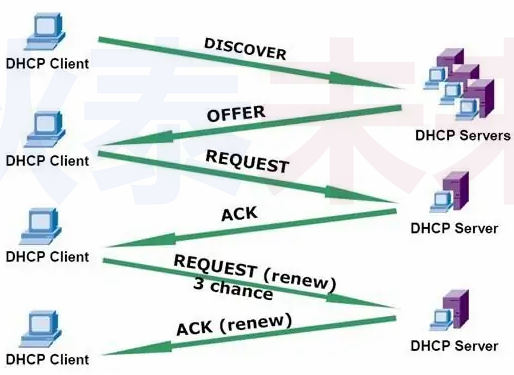

## 1.3预备工作

### 1.3.1 socket 属性设置 (option)

>- socket 的本质是对本机网络资源的一种标识
>- socket 本身有各种属性 (不同的连接 , 属性可能不同)
>- 通过 setsockopt(...) / getsockopt(...) 可存取指定 socket 的属性值
>- socket 属性的改变可造成 socket 数据收发行为的改变

### 1.3.2 TCP编程中涉及的用法

>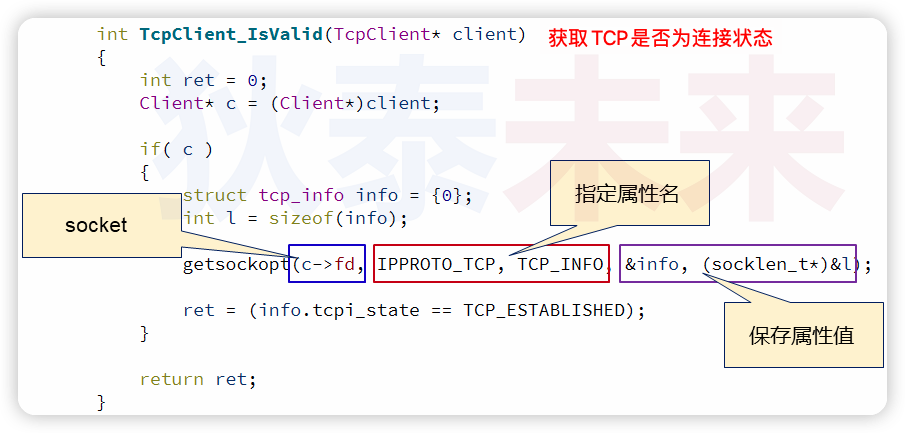

### 1.3.3 `setsockopt(...)` /  `getsockopt(...)` 属性存取函数

>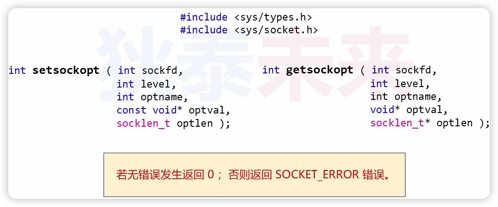

### 1.3.4 UDP广播

>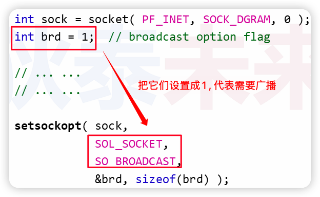
>
>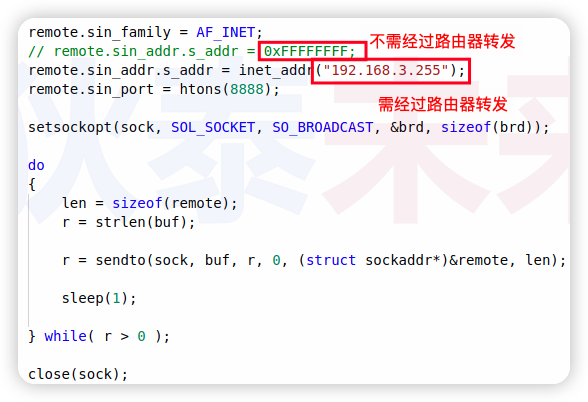

### 1.3.5 广播实验

[[参考链接]](https://github.com/WONGZEONJYU/STU_LINUX_NETWORK/tree/main/16.udp_Data_Broadcast)

>1. receiver
>
>```c++
>#include <sys/types.h>
>#include <sys/socket.h>
>#include <netinet/in.h>
>#include <arpa/inet.h>
>#include <cstdio>
>#include <unistd.h>
>#include <cstring>
>#include <iostream>
>
>using namespace std;
>
>int main(int argc, char *argv[])
>{
>    int sock{socket(PF_INET,SOCK_DGRAM,0)};
>
>    if (-1 == sock){
>        cout << "socket error\n";
>        return -1;
>    }
>
>    cout << "create socket success :" << sock << '\n';
>
>    sockaddr_in local {};
>    local.sin_family = AF_INET;
>    local.sin_addr.s_addr = htonl(INADDR_ANY);
>    local.sin_port = htons(9000);
>
>    if ( -1 == bind( sock,reinterpret_cast<const sockaddr *>(&local),sizeof(local) ) ){
>        cout << "udp bind error" << '\n';
>        return -1;
>    }
>
>    sockaddr_in remote {};
>    remote.sin_family = AF_INET;
>    remote.sin_addr.s_addr = inet_addr("127.0.0.1");
>    remote.sin_port = htons(8888);
>
>    for(;;) {
>
>        char input[32]{},buf[128]{};
>
>        socklen_t len {sizeof(remote)};
>
>        const auto r {recvfrom(sock,buf,sizeof(buf),0,reinterpret_cast<sockaddr * >(&remote),&len)};
>
>        if (r > 0){
>
>            buf[r] = 0;
>            cout << "Receive :" << buf << '\n';
>
>        }else{
>            break;
>        }
>    }
>
>    close(sock);
>
>    return 0;
>}
>
>```
>
>2. sender
>
>```c++
>#include <sys/types.h>
>#include <sys/socket.h>
>#include <netinet/in.h>
>#include <arpa/inet.h>
>#include <cstdio>
>#include <unistd.h>
>#include <cstring>
>#include <iostream>
>
>using namespace std;
>
>int main(int argc, char *argv[])
>{
>    int server {socket(PF_INET,SOCK_DGRAM,0)};
>
>    if (-1 == server){
>        cout << "server socket error\n";
>        return -1;
>    }
>
>    sockaddr_in saddr {};
>    saddr.sin_family = AF_INET;
>    saddr.sin_addr.s_addr = htonl(INADDR_ANY);//htonl函数把小端转换成大端（网络字节序采用大端）
>    saddr.sin_port = htons(8888);
>
>    if ( -1 == bind( server,reinterpret_cast<const sockaddr *>(&saddr),sizeof(saddr) ) ){
>        cout << "udp server bind error\n";
>        return -1;
>    }
>
>    cout << "udp server start success\n";
>
>    sockaddr_in remote {};
>
>    remote.sin_family = AF_INET;
>    remote.sin_addr.s_addr = inet_addr("10.211.55.255");  //直接广播，需知道当前网络标识
>    //remote.sin_addr.s_addr = 0xffffffff;                    //本地广播，不经过路由器
>    remote.sin_port = htons(9000);
>    socklen_t len {sizeof(remote)};
>
>    int brd {1};
>    setsockopt(server,SOL_SOCKET,SO_BROADCAST,&brd,sizeof(brd));//socket广播设置
>
>    char buf[32]{"hello_world"};
>    const auto r { strlen(buf)} ;
>    buf[r] = 0;
>
>    for(;;){
>        sendto(server,buf,r,0,reinterpret_cast<const sockaddr * >(&remote),len);
>        sleep(1);
>    }
>
>    close(server);
>    return 0;
>}
>
>```

#### 1.3.5.1 直接广播

>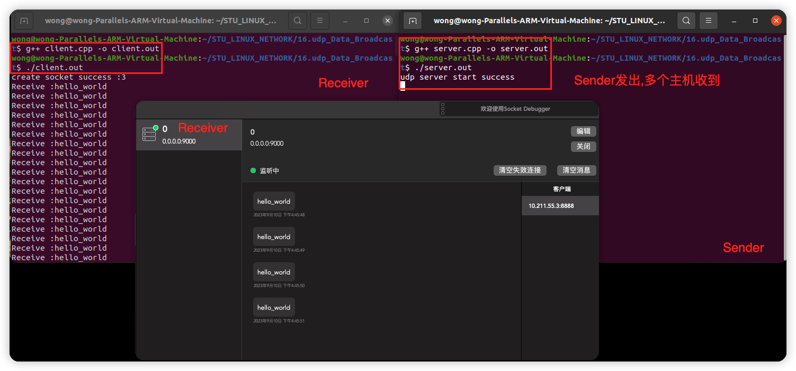

#### 1.3.5.2 本地广播

>只列出修改部份代码:
>
>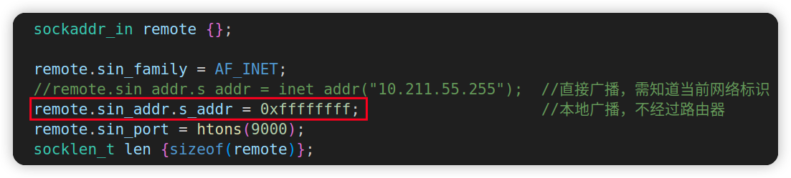
>
>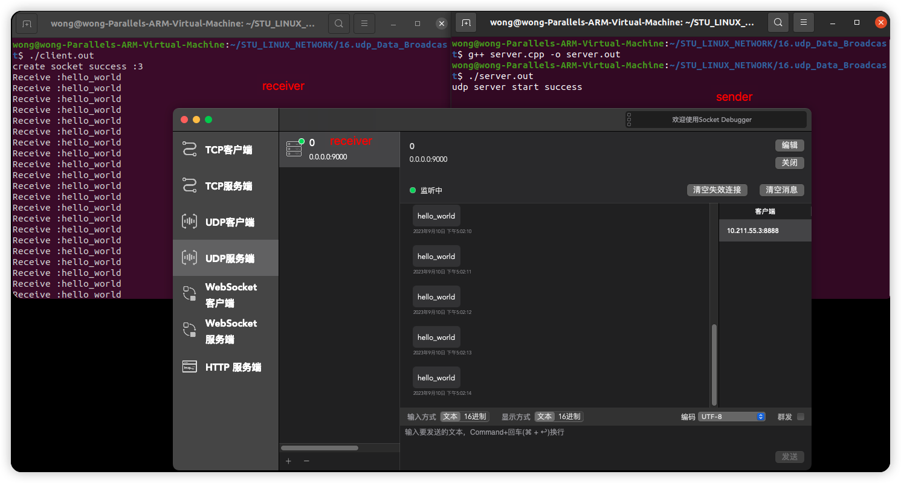

❓思考 : `UDP` 是否还有其它一对多的数据发送方式?

# 2.多播

## 2.1 `UDP` 通信中的多播

>- 多播是向 **$\color{red}{特定组中的所有主机}$** 传输数据的方法 , **$\color{SkyBlue}{多播也称之为组播}$** 多
>- 播数据传输的特点 : 
>   - 多播发送者针对特定的多播组 , 只发送 1次数据 , 组内主机均可收到数据
>   - 主机加入特定组 , 即可接收该组中的多播数据
>   - 多播组可在 `IP` 地址范围内任意增加
>

## 2.2 关键问题 : 如何收发多播数据 ?

>- 多播组是一个D类地址 ( 224.0.0.0 - 239.255.255.255 )
>- "加入多播组" 可理解为 `UDP` 网络程序进行的申请
>   - 如 : 申请接收发往 239.234.111.222 的多播数据
>   - 即 : 设置属性 ( `IPPROTO_IP` , `IP_ADD_MEMBERSHIP` )
>- —发送多播数据的方式 , 与发送普通 `UDP` 数据的方式相同
>   - 预备操作 : 设置属性 , 如: ( `IPPROTO_IP` ,  `IP_MULTICAST_TTL` )
>

## 2.3 注意事项

>- 加入同一个多播组的主机不一定在同一个网络中
>- 因此 , **$\color{red}{必须设置多播数据的最多转发次数}$** (TTL)
>   - TTL ( 即 : Time To Live ) 是决定数据传递距离的主要因素
>   - TTL 用整数表示 , 并且每经过1个路由器就减少1
>   - 当TTL变为0时 , 数据无法继续被传递 , 只能销毁
>

## 2.4 多播程序设计

### 2.4.1 发送端

>- `IP _MULTICAST_TTL`
>   - 用于设置多播数据的"最远传播距离" , 默认 :1
>- `IP_MULTICAST_IF`
>   - 用于设置多播数据从哪一个网络接口 (网卡) 发送出去 , 默认: 0.0.0.0 (多网卡最好自己指定那个网卡，通过 `IP` 地址就可以指定)
>- `IP_MULTICAST_LOOP`
>   - 用于设置多播数据是否发送回本机 , 默认 : 1
>
>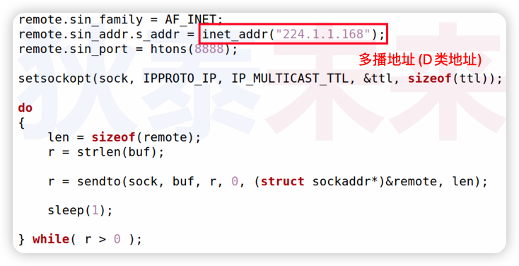

### 2.4.2 接收端

>- `IP_ADD_MEMBERSHIP`
>   - 用于申请加入多播组 , 参数为 : 多播组地址 和 本机地址
>
>
>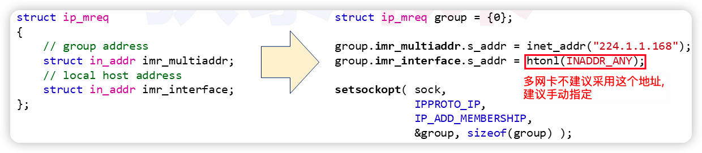
>
>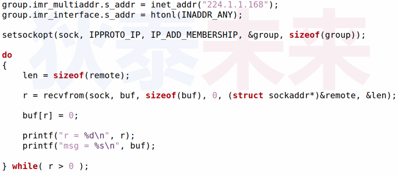
>
>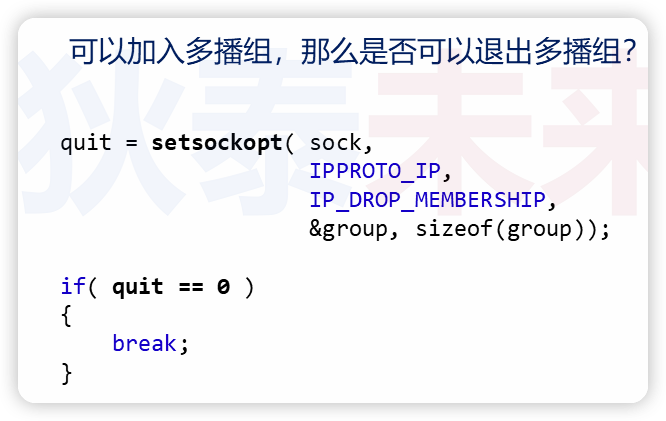

## 2.5 实验

[[参考链接]](https://github.com/WONGZEONJYU/STU_LINUX_NETWORK/tree/main/17.udp_Multicast)

>1. 发送端
>
>```c++
>#include <sys/types.h>
>#include <sys/socket.h>
>#include <netinet/in.h>
>#include <arpa/inet.h>
>#include <cstdio>
>#include <unistd.h>
>#include <cstring>
>#include <iostream>
>
>using namespace std;
>
>int main(int argc, char *argv[])
>{
>    const int server {socket(PF_INET,SOCK_DGRAM,0)};
>
>    if (-1 == server){
>        cout << "tx socket error\n";
>        return -1;
>    }
>
>    sockaddr_in local {};
>    local.sin_family = AF_INET;
>    local.sin_addr.s_addr = htonl(INADDR_ANY);//htonl函数把小端转换成大端（网络字节序采用大端）
>    //local.sin_addr.s_addr = inet_addr("192.168.80.128");
>    local.sin_port = htons(8888);
>
>    if ( -1 == bind( server,reinterpret_cast<const sockaddr *>(&local),sizeof(local) ) ){
>        cout << "tx bind error\n";
>        return -1;
>    }
>
>    cout << "tx start success\n";
>
>    socklen_t len{};
>#if 0
>
>    {
>        int ttl{};
>        len  = sizeof(ttl);
>        getsockopt(server,IPPROTO_IP,IP_MULTICAST_TTL,&ttl,&len);
>        cout << "default ttl = " << ttl << '\n';
>
>        //设在TTL的值，路由器转发的次数
>        ttl = 32;
>        len  = sizeof(ttl);
>        setsockopt(server,IPPROTO_IP,IP_MULTICAST_TTL,&ttl,len);
>        cout << "current ttl = " << ttl << '\n';
>    }
>
>    {
>        int loop{};//数据是否回环发送回本机 0不发送，非0发送 ,默认非0
>        len = sizeof(loop);
>        getsockopt(server,IPPROTO_IP,IP_MULTICAST_LOOP,&loop,&len);
>        cout << "default loop = " << loop << '\n';
>
>        // loop = 0;
>        // len = sizeof(loop);
>        // setsockopt(server,IPPROTO_IP,IP_MULTICAST_LOOP,&loop,len);
>        // cout << "current loop = " << loop << '\n';
>    }
>
>    {    
>        in_addr addr;
>        // len = sizeof(addr);
>        // getsockopt(server,IPPROTO_IP,IP_MULTICAST_IF,&addr,&len);
>        // cout << "ip = " << inet_ntoa(addr) << '\n';
>
>        addr.s_addr = inet_addr("192.168.199.128");//采用那个网卡作为多播的发送网卡
>        //addr.s_addr = htonl(INADDR_ANY);//多个网卡不建议采用0.0.0.0这个地址，有可能出现接收端无法收到数据的情况
>        len = sizeof(addr);
>        setsockopt(server,IPPROTO_IP,IP_MULTICAST_IF,&addr,len);
>        cout << "ip = " << inet_ntoa(addr) << '\n';
>    }
>
>#endif
>
>    sockaddr_in remote {};
>    remote.sin_family = AF_INET;
>    remote.sin_addr.s_addr = inet_addr("224.1.1.168");/*多播IP地址*/
>    remote.sin_port = htons(9000);
>    len = sizeof(remote);
>
>    char buf[32]{"hello_world"};
>    const auto r {strlen(buf)};
>
>    for(;;){
>        sendto(server,buf,r,0,reinterpret_cast<const sockaddr * >(&remote),len);
>        sleep(1);
>    }
>
>    close(server);
>
>    return 0;
>}
>
>```
>
>2. 接收端
>
>```c++
>#include <sys/types.h>
>#include <sys/socket.h>
>#include <netinet/in.h>
>#include <arpa/inet.h>
>#include <cstdio>
>#include <unistd.h>
>#include <cstring>
>#include <iostream>
>
>using namespace std;
>
>int main(int argc, char *argv[])
>{
>    const int sock{socket(PF_INET,SOCK_DGRAM,0)};
>
>    if (-1 == sock){
>        cout << "socket error\n";
>        return -1;
>    }
>
>    cout << "create socket success :" << sock << '\n';
>
>    sockaddr_in local {};
>    local.sin_family = AF_INET;
>    local.sin_addr.s_addr = htonl(INADDR_ANY);
>    local.sin_port = htons(9000);
>
>    if ( -1 == bind( sock,reinterpret_cast<const sockaddr *>(&local),sizeof(local) ) ){
>        cout << "udp bind error\n";
>        return -1;
>    }
>
>    ip_mreq group{};
>    group.imr_multiaddr.s_addr = inet_addr("224.1.1.168");	//发送端发往多播数据的IP地址
>    group.imr_interface.s_addr = htonl(INADDR_ANY); /*单网卡没有问题,多网卡建议手动确定那个网卡*/
>
>    setsockopt(sock,IPPROTO_IP,IP_ADD_MEMBERSHIP,&group,sizeof(group));		//接收端加入多播组设置
>
>    for(;;) {
>
>        char input[32]{},buf[128]{};
>
>        sockaddr_in remote {};
>        socklen_t len {sizeof(remote)};
>
>        const auto r {recvfrom(sock,buf,sizeof(buf),0,reinterpret_cast<sockaddr * >(&remote),&len)};
>
>        if (r > 0){
>
>            buf[r] = 0;
>            cout << "ip = " << inet_ntoa(remote.sin_addr) <<
>                    "\nport = " << ntohs(remote.sin_port) << 
>                    "\nReceive : " << buf << '\n';
>
>        }else{
>            break;
>        }
>    }
>
>    close(sock);
>    return 0;
>}
>
>```

2.5.1 实验一 (基本实验)

>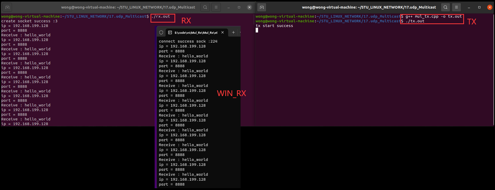
>
>```tex
>基本实验不设置 TTL IF LOOP
>```
>
>

2.5.2 实验二 (深入实验)

```tex
做本实验前,请把#if 0改成 #if 1
```

>1. 把 `IP_MULTICAST_LOOP` 设置为0,本地不接收回环数据
>
>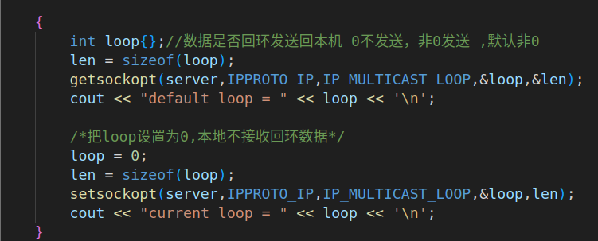
>
>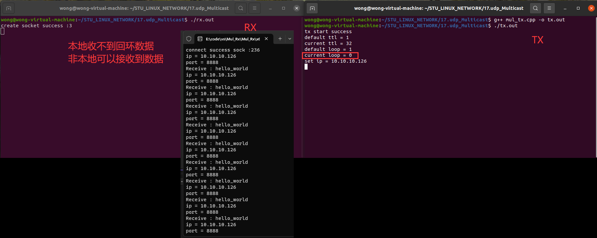
>
>

# 3. 小结

>- 单播 : 
>   - 一对一数据发送 , 即 : 指定目标主机发送数据
>- 广播:
>   - 本地广播：本地局域网广播数据 , 所有主机均可接收数据
>   - 直接广播：指定网络广播数据 , 目标网络中的主机均可接收数据
>- 多播 (组播) :
>   - 向指定的多播地址发送数据, "订阅" 该地址的主机均可接收数据
>

# 4.历史遗留问题

>- 什么是多播? 什么是广播?
>   - 多播 : 也称为组播 , 加入多播组的主机可接收发送的数据
>   - 广播 : 同一网络内的所有主机可接收到发送的数据

