# 十四、网络通信框架的完善

> ❓问题 : 如何扩展之前开发的通信框架 , 使其支持 `UDP` 通信 , 进而成为一个完善的网络通信框架 ? 

# 1.`UDP` 通信扩展

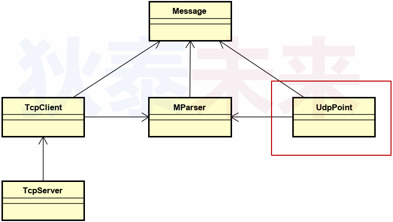 

# 2.`UDP` 通信实体概要设计

* 每个 `UDP Point` 地位对等 , 可通过 `IP` 地址 和 `Port` 号进行通信
* `UDP Point` 数据收发单位为 : `Message` 或 `Byte`
* 在接口设计上 , 与 `TcpClient` 保持一致（框架接口一致性）
* **$\color{red}{目标 : 封装原生 socket 细节 , 关注 UDP 通信逻辑}$**

 

# 3. `UDP` 通信实体接口设计

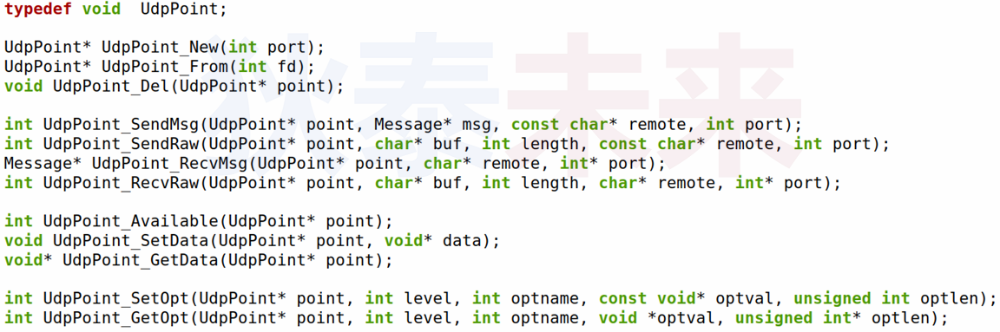 

# 4. 关键代码实现

## 4.1 初始化

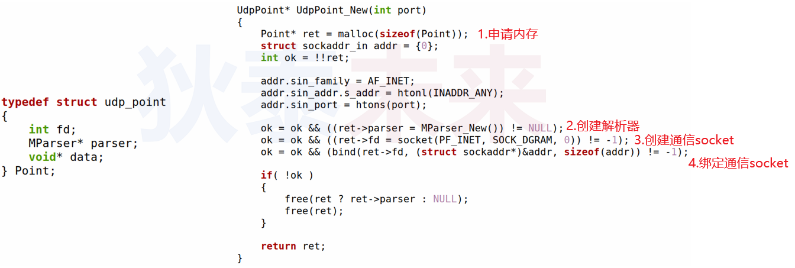 

## 4.2 消息接收

* 由于 `UDP` 是以 **数据报** 方式进行通信 ( 非数据流方式 , 报文间有明显边界 )
* 因此 , **$\color{red}{不能直接通过}$** `MParser_ ReadFd(...)` **$\color{red}{解析出消息}$**
* 必须先将报文完整接收到内存中 , 再进行从内存中解析出消息
* 即通过 `MParser_ReadMem(...)` 间接完成消息解析

>❓问题 : 如何获取缓冲区中的报文长度 ?

1. 通过 `MSG_PEEK` 去窥探一下当前接收了多少数据 -->length
2. 创建内存 `malloc(...)`
3. 通过 `recvfrom(...)` 接收数据
4. 解析数据 `MParser_ReadMem(...)`

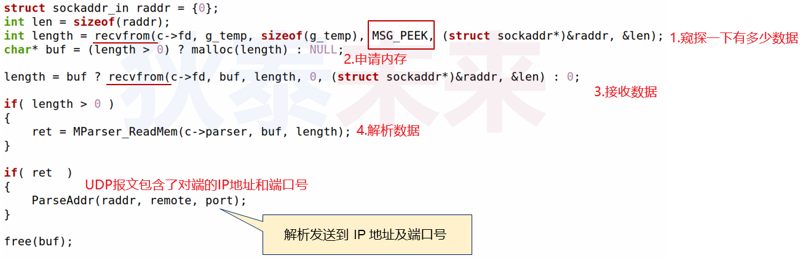 

## 4.3 消息发送

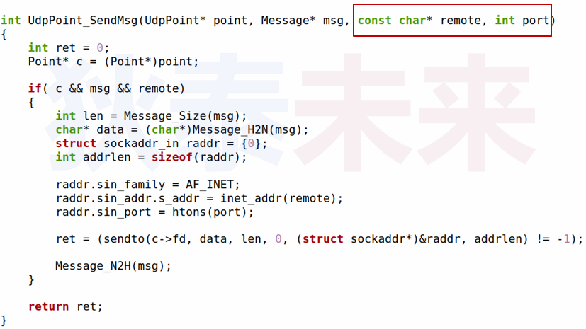 

## 4.4 通信选项设置

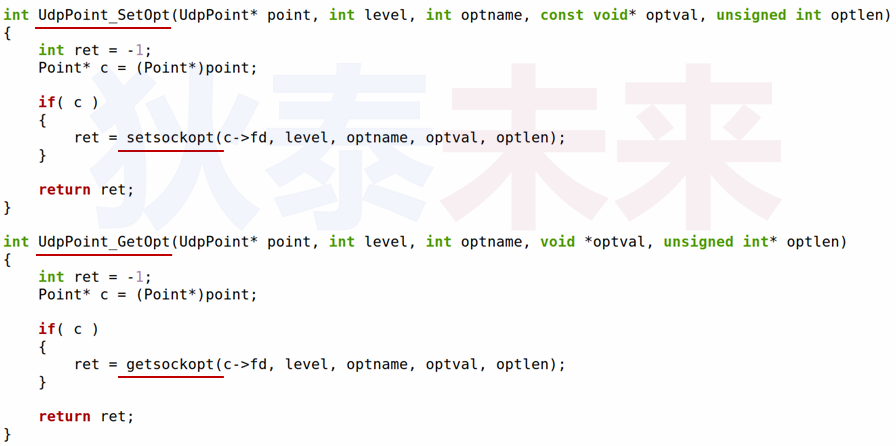 

# 5.实验

[[参考链接]](https://github.com/WONGZEONJYU/STU_LINUX_NETWORK/tree/main/18.udp_frame)

## 5.1 udp_point.h

>```c++
>#ifndef UDP_POINT_H
>#define UDP_POINT_H
>
>#include "message.h"
>
>using UdpPoint = void;
>
>UdpPoint* UdpPoint_New(int port);
>UdpPoint* UdpPoint_From(int fd);
>
>int UdpPoint_SendMsg(UdpPoint* point, Message* msg, const char* remote, int port);
>int UdpPoint_SendRaw(UdpPoint* point, const char* buf, int length, const char* remote, int port);
>Message* UdpPoint_RecvMsg(UdpPoint* point, char* remote, int* port);
>int UdpPoint_RecvRaw(UdpPoint* point, char* buf, int length, char* remote, int* port);
>
>void UdpPoint_Del(UdpPoint* point);
>int UdpPoint_Available(UdpPoint* point);
>void UdpPoint_SetData(UdpPoint* point, void* data);
>void* UdpPoint_GetData(UdpPoint* point);
>
>int UdpPoint_SetOpt(UdpPoint* point, int level, int optname, const void* optval, unsigned int optlen);
>int UdpPoint_GetOpt(UdpPoint* point, int level, int optname, void* optval, unsigned int* optlen);
>
>#endif
>
>```

## 5.2 udp_point.cpp

>```c++
>#include <sys/types.h>
>#include <sys/socket.h>
>#include <netinet/in.h>
>#include <netinet/tcp.h> 
>#include <arpa/inet.h>
>#include <unistd.h>
>#include <cstdlib>
>#include <cstring>
>#include <iostream>
>#include "msg_parser.h"
>#include "udp_point.h"
>
>struct Point {
>    int fd;
>    MParser * parser;
>    void * data;
>};
>
>static void ParseAddr(struct sockaddr_in addr, char* ip, int* port)
>{
>    if( ip ){
>        strcpy(ip, inet_ntoa(addr.sin_addr));
>    }
>
>    if( port ){
>        *port = ntohs(addr.sin_port);
>    }
>}
>
>//窥探一下当前有多少数据
>static auto has_data_helper(const int fd) 
>{
>    sockaddr_in raddr {};
>    socklen_t addrlen {sizeof(raddr)};
>    static char g_temp[1024 * 4]{};
>    return recvfrom(fd, g_temp, sizeof(g_temp),
>                    MSG_PEEK | MSG_DONTWAIT, 
>                    reinterpret_cast<sockaddr*>(&raddr), &addrlen) ;
>}
>
>UdpPoint* UdpPoint_New(const int port)
>{
>    auto ret { reinterpret_cast<Point * >(malloc(sizeof(Point))) };
>
>    int ok{ !!ret };
>
>    sockaddr_in addr {};
>    addr.sin_family = AF_INET;
>    addr.sin_addr.s_addr = htonl(INADDR_ANY);
>    addr.sin_port = htons(port);
>
>    ok = ok && (nullptr != (ret->parser = MParser_New()));
>
>    ok = ok && (-1 != (ret->fd = socket(AF_INET,SOCK_DGRAM,0)));
>
>    ok = ok && (-1 != bind(ret->fd,reinterpret_cast<const sockaddr *>(&addr),sizeof(addr)));
>
>    if (ok){
>        ret->data = nullptr;
>    }else{
>        ret ? (MParser_Del(ret->parser),nullptr) : nullptr;
>        ret ? close(ret->fd): -1;
>        free(ret);
>        ret = nullptr;
>    }
>
>    return ret;
>}
>
>UdpPoint* UdpPoint_From(const int fd)
>{
>    auto ret { reinterpret_cast<Point * >(malloc(sizeof(Point))) };
>
>    if (ret){
>        ret->fd = fd;
>        ret->parser = MParser_New();
>        ret->data = nullptr;
>    }
>
>    return (ret && ret->parser) ? ret : (free(ret),nullptr);
>}
>
>int UdpPoint_SendMsg(UdpPoint* point, Message* msg, const char* remote, int port)
>{
>    auto c { reinterpret_cast<Point * >(point) } ;
>
>    int ret {};
>
>    if (c && msg && remote){
>
>        const int len {Message_Size(msg)};
>
>        auto data {reinterpret_cast<const char *>(Message_H2N(msg))};
>
>        ret = UdpPoint_SendRaw(c,data,len,remote,port);
>
>        Message_N2H(msg);
>    }
>
>    return ret;
>}
>
>int UdpPoint_SendRaw(UdpPoint* point, const char* buf,const int length, const char* remote,const int port)
>{
>    auto c { reinterpret_cast<Point * >(point) } ;
>
>    int ret {};
>
>    if (c && buf && remote){
>
>        sockaddr_in addr{};
>        const socklen_t len {sizeof(addr)};
>
>        addr.sin_family = AF_INET;
>        addr.sin_addr.s_addr = inet_addr(remote);
>        addr.sin_port = htons(port);
>
>        ret = (-1 != (sendto(c->fd,buf,length,0,
>                    reinterpret_cast<const sockaddr * >(&addr),len)));
>    }
>
>    return ret;
>}
>
>Message* UdpPoint_RecvMsg(UdpPoint* point, char* remote, int* port)
>{
>    auto c { reinterpret_cast<Point * >(point) } ;
>
>    Message* ret{};
>
>    if (c){
>
>        sockaddr_in raddr {};
>        socklen_t addrlen {sizeof(raddr)};
>
>        auto length { has_data_helper(c->fd) };//窥探一下当前有多少数据
>
>        auto buf { (length > 0) ? reinterpret_cast<unsigned char *>(malloc(length)) : nullptr };
>
>        length = recvfrom(c->fd, buf, length, 0, 
>                        reinterpret_cast<sockaddr*>(&raddr), &addrlen);
>
>        if (length > 0){
>            ret = MParser_ReadMem(c->parser,buf,length);
>        }
>
>        if(ret){
>            ParseAddr(raddr,remote,port);//解析发送端的 IP地址及端口号
>        }
>    }
>
>    return ret;
>}
>
>int UdpPoint_RecvRaw(UdpPoint* point, char* buf, const int length, char* remote, int* port)
>{
>    auto c { reinterpret_cast<Point * >(point) };
>
>    int ret {-1};
>
>    if (c && buf){
>
>        sockaddr_in addr{};
>        socklen_t len {sizeof(addr)};
>        ret = recvfrom(c->fd ,buf ,length ,0 ,reinterpret_cast<sockaddr *>(&addr),&len);
>
>        if (-1 != ret){
>            ParseAddr(addr,remote,port);
>        }
>    }
>
>    return ret;
>}
>
>void UdpPoint_Del(UdpPoint* point)
>{
>    auto c { reinterpret_cast<Point * >(point) };
>
>    if(c){
>        close(c->fd);
>        MParser_Del(c->parser);
>        free(c);
>    }
>}
>
>int UdpPoint_Available(UdpPoint* point)
>{
>    auto c { reinterpret_cast<Point * >(point) };
>    return c ? has_data_helper(c->fd) : -1;
>}
>
>void UdpPoint_SetData(UdpPoint* point, void* data)
>{
>    auto c { reinterpret_cast<Point * >(point) };
>    if(c){
>        c->data = data;
>    }
>}
>
>void* UdpPoint_GetData(UdpPoint* point)
>{
>    auto c { reinterpret_cast<Point * >(point) };
>    return c ? c->data : nullptr;
>}
>
>int UdpPoint_SetOpt(UdpPoint* point, int level, int optname, const void* optval, const unsigned int optlen)
>{
>    auto c { reinterpret_cast<Point * >(point) };
>    return c ? setsockopt(c->fd,level,optname,optval,optlen): -1;
>}
>
>int UdpPoint_GetOpt(UdpPoint* point, int level, int optname, void* optval, unsigned int* optlen)
>{
>    auto c { reinterpret_cast<Point * >(point) };
>    return c ? getsockopt(c->fd,level,optname,optval,optlen) : -1;
>}
>
>```

## 5.1 裸数据收发测试

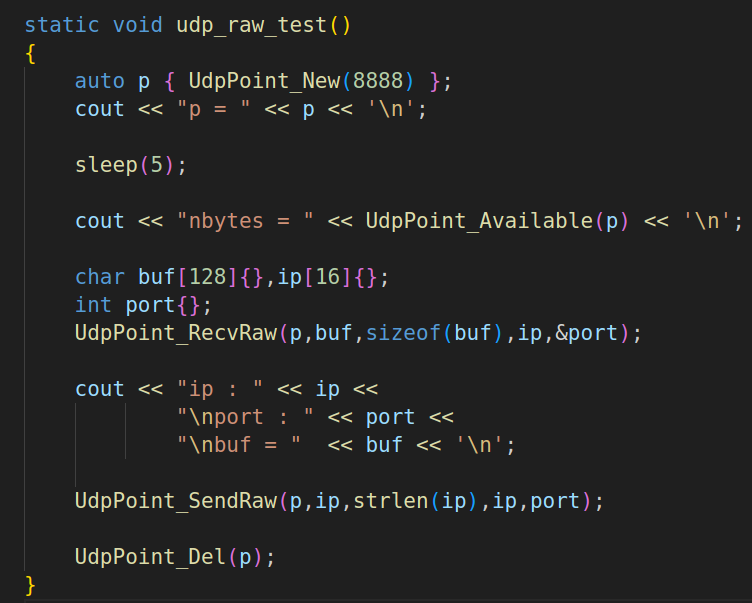 

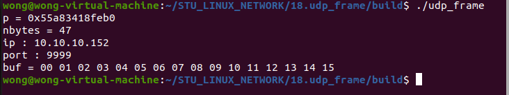 

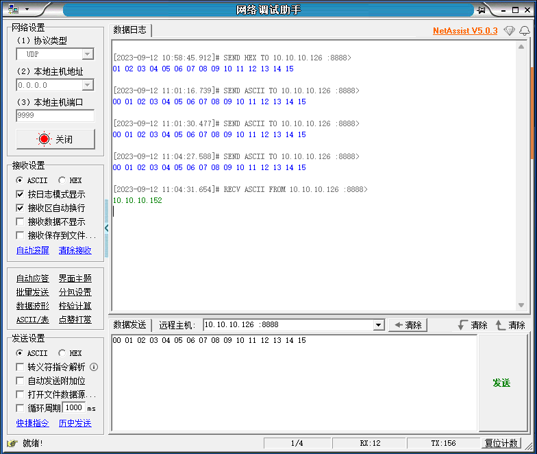 

## 5.2 协议消息收发测试

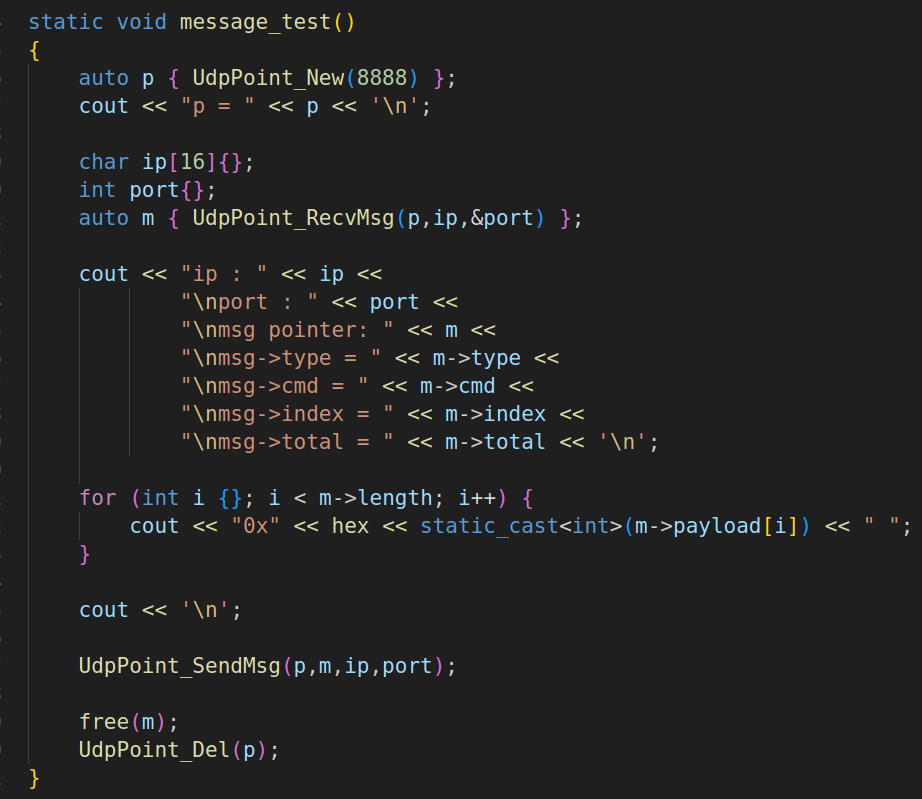 

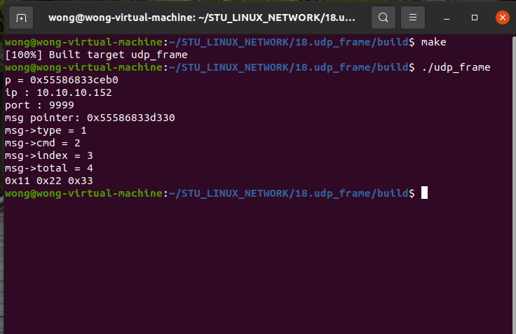 

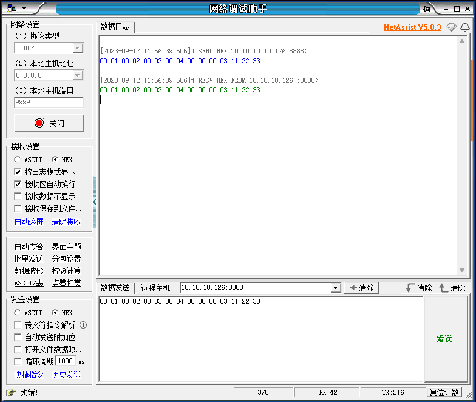 
