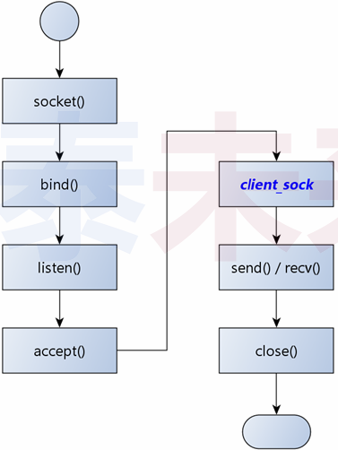
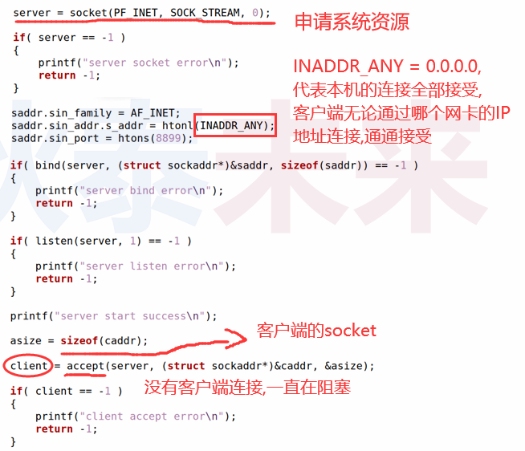
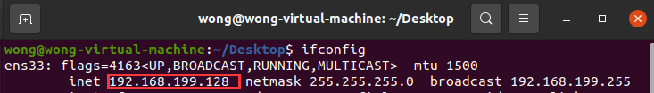
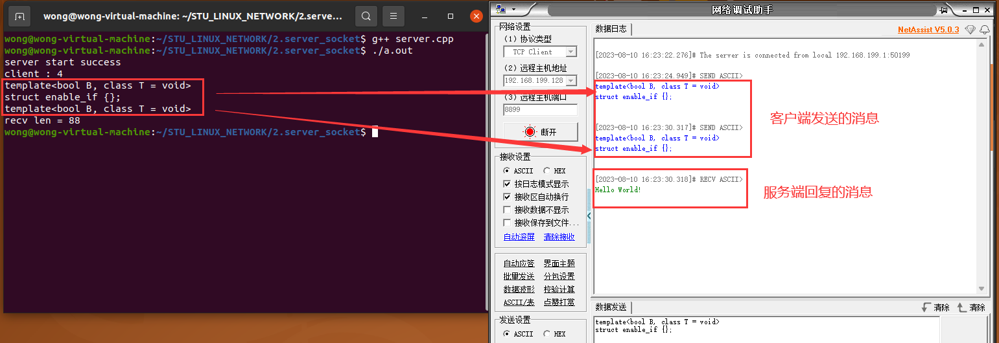
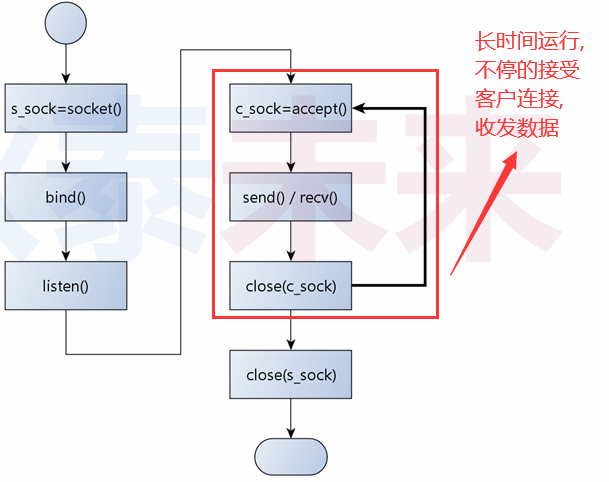
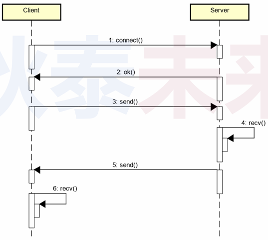
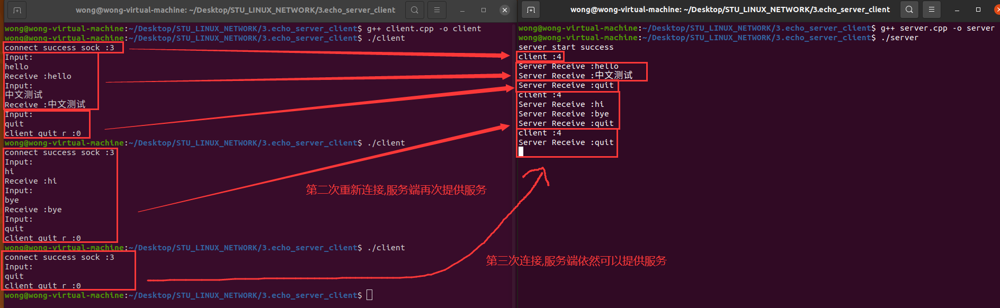

# (二) 服务端编程初体验

问题 : 上次课编写的网络程序是什么角色?

# 1.客户端/服务端(C/S模型) 编程模式

>- **$\color{red}{服务端长期暴露于网络}$** , 并等待客户端连接
>- **$\color{SkyBlue}{客户端发起连接动作}$** , 并等待服务端回应
>- 特点 : 
>   - 服务端无法主动连接客户端
>   - 客户端只能按照预定义的方式连接服务端

## 1.1 服务端编程模式

>1. 准备网络连接
>2. 绑定端口
>3. 进入端口监听状态
>4. 等待连接
>
>

## 1.2 服务端核心工作：绑定 & 监听 & 接收

### 1.2.1 绑定

>```c++
>int bind(int sock,struct sockaddr *addr,socklen_t addrlen);
>//addr是socket地址,里面包含(ip,port)的信息
>```

### 1.2.2 监听

> ```c++
> int listen(int sock,int backlog);
> //backlog是队列长度，（可连接最多客户端数）
> ```

### 1.2.3 接受连接

> ```c++
> int accept(int sock,struct sockaddr *addr,socklen_t * addrlen); //此函数是阻塞式
> /*该函数的返回值是与客户端通讯的socket*/
> /*addr是客户端的ip地址和port等信息*/
> ```

## 1.3 深度剖析服务端

>- 服务端 `socket` 只用于 **$\color{SkyBlue}{接收连接}$** , 不进行 **$\color{SkyBlue}{实际通信}$** 当
>- 接收到连接时 , `accept(...)` 函数返回与客户端通信的 `socket`
>- 服务端 `socket` 产生用于通信的客户端 `socket`
>- ❓所以 , `socket` 究竟是什么玩意 ? 如何理解 ?

## 1.4 深入理解 `socket(...)` 函数

### 1.4.1 `socket(...)` 是什么 ？

> - `socket(...)` 是一个 “多功能” 函数 , 用于提供通信能力

### 1.4.2 `socket(...)` 返回的又是什么 ?

>- `socket(...)` 的返回值是用于通信的资源标识符

### 1.4.3 `socket(...)` 还能做什么 ?

> - `socket(...)` 可提供不同类型的通信功能 (本地进程间通信)

## 1.5 服务端编程示例

>

## 1.6 编程实验 : 服务端编程

>[[参考链接]](https://github.com/WONGZEONJYU/STU_LINUX_NETWORK/blob/main/2.server_socket/server.cpp)
>
>```c++
>#include <sys/types.h>
>#include <sys/socket.h>
>#include <netinet/in.h>
>#include <arpa/inet.h>
>#include <cstdio>
>#include <unistd.h>
>#include <cstring>
>#include <iostream>
>
>using namespace std;
>
>int main() 
>{
>    int server { socket(PF_INET,SOCK_STREAM,0) };
>
>    if (-1 == server){
>        cout << "server socket error" << endl;
>        return -1;
>    }
>
>    sockaddr_in saddr {};
>    saddr.sin_family = AF_INET;
>    saddr.sin_addr.s_addr = htonl(INADDR_ANY);//htonl函数把小端转换成大端（网络字节序采用大端）
>    saddr.sin_port = htons(8899);
>
>    if (-1 == bind(server,reinterpret_cast<const sockaddr *>(&saddr),sizeof(saddr))){
>        cout << "server bind error\n";
>        return -1;
>    }
>
>    if (-1 == listen(server,1)){    /*每次只服务一个客户端*/
>        cout << "server listen error\n";
>        return -1;
>    }
>    
>    cout << "server start success\n";
>    
>    sockaddr_in caddr {};
>    socklen_t asize {sizeof(caddr)};
>
>    int client { accept(server,reinterpret_cast<sockaddr *>(&caddr),&asize) };
>
>    if (-1 == client){
>        cout << "client accept error\n";
>        return -1;
>    }
>
>    cout << "client : " << client << '\n';//client的数值表示系统资源的id
>
>    int len {};
>    
>    do{
>
>        char buf[32]{};
>
>        int r ( recv(client,reinterpret_cast<void *>(buf),sizeof(buf)/sizeof(*buf),0) );
>
>        if (r > 0){
>            len += r;
>        }
>
>        for (int i {}; i < r; i++){
>            cout << buf[i];
>        }
>
>    } while (len < 64);
>
>    cout << "\nrecv len = " << len << '\n';
>
>    constexpr char temp_str[] {"Hello World!"};
>
>    send(client,temp_str,sizeof(temp_str),0);
>
>    sleep(1);
>
>    close(client);
>    
>    close(server);
>
>    return 0;
>}
>```
>
>
>
>

## 1.7 客户端 / 服务端 (C/S) 编程的核心模式

>- 服务端 **长时间运行** ( **$\color{red}{死循环}$** ) 接收客户端请求
>
>- 客户端连接后向服务端发送请求 ( **$\color{red}{协议数据}$** )

### 1.7.1 流程图

>

### 1.7.2 顺序图

>

# 2. 客户端 / 服务端 编程实验

## 2.1 需求

>1. 服务端 **持续监听** 客户端连接
>2. 服务端被连接后 `echo` (返回相同数据) 客户端数据
>3. 服务端接收到 `quit` 后断开连接
>4. 客户端 **接收用户输入** 并发送到服务端

## 2.2 编程实验 : C/S编程

>[[参考链接]](https://github.com/WONGZEONJYU/STU_LINUX_NETWORK/tree/main/3.echo_server_client)

### 2.2.1 服务端

>```c++
>#include <sys/types.h>
>#include <sys/socket.h>
>#include <netinet/in.h>
>#include <arpa/inet.h>
>#include <cstdio>
>#include <unistd.h>
>#include <cstring>
>#include <iostream>
>#include <signal.h>
>#include <type_traits>
>#include <functional>
>
>using namespace std;
>
>function<void(int,siginfo_t*,void*)> signal_func;
>
>void signal_handler(const int sig,siginfo_t *info, void*)
>{
>    signal_func(sig,info,nullptr);
>}
>
>int main(int argc,char* argv[])
>{
>    int server {socket(PF_INET,SOCK_STREAM,0)};
>    int client {-1};
>    
>    if (-1 == server){
>        cout << "server socket error\n";
>        return -1;
>    }
>
>    {
>        /*此处跟网络无关,仅仅是为了ctrl+c终止程序销毁server,client*/
>        struct sigaction act{};
>        act.sa_flags = SA_RESTART | SA_SIGINFO ;
>        act.sa_sigaction = signal_handler;
>
>        signal_func = move([=](const int sig,siginfo_t* info,void*)mutable{
>            constexpr char str[] {"\nexit\n"};
>            write(1,str,sizeof(str));
>            close(client);
>            close(server);
>            exit(0);
>        });
>
>        sigaction(SIGINT,&act,nullptr);
>    }
>
>    sockaddr_in saddr {};
>    saddr.sin_family = AF_INET;
>    saddr.sin_addr.s_addr = htonl(INADDR_ANY);//htonl函数把小端转换成大端（网络字节序采用大端）
>    saddr.sin_port = htons(8888);
>
>    if ( -1 == bind( server,reinterpret_cast<const sockaddr *>(&saddr),sizeof(saddr) ) ){
>        cout << "server bind error\n";
>        return -1;
>    }
>
>    if ( -1 == listen(server,1) ){
>        cout << "server listen error\n";
>        return -1;
>    }
>
>    cout << "server start success\n";
>
>    for(;;){
>
>        sockaddr_in caddr {};
>        socklen_t asize {sizeof(caddr)};
>
>        client = accept(server,reinterpret_cast<sockaddr *>(&caddr),&asize);
>
>        if (-1 == client){
>            cout << "client accept error\n";
>            return -1;
>        }
>
>        cout << "client :" << client << '\n'; //client的数值表示系统资源的id
>
>        int r {},len{};
>
>        do{
>            char buf[32]{};
>
>            r = recv(client,buf,(sizeof(buf)/sizeof(*buf)),0);
>
>            if (r > 0){
>
>                cout << "Server Receive :" << buf << '\n';
>
>                if ( strcmp(buf,"quit") ){
>
>                    len = send(client,buf,r,0);
>
>                }else{ /*0 == strcmp(...) 跳出do while , 客户端断开连接*/
>                   break; 
>                }
>            }
>
>        } while (r > 0);
>
>        close(client);
>    }
>
>    close(server);
>
>    return 0;
>}
>
>
>```
>

### 2.2.2 客户端

>```c++
>#include <sys/types.h>
>#include <sys/socket.h>
>#include <netinet/in.h>
>#include <arpa/inet.h>
>#include <cstdio>
>#include <unistd.h>
>#include <cstring>
>#include <iostream>
>
>using namespace std;
>
>int main(int argc,char* argv[])
>{
>    int sock{socket(PF_INET,SOCK_STREAM,0)};
>
>    if (-1 == sock){
>        cout << "socket error\n";
>        return -1;
>    }
>
>    sockaddr_in addr {};
>    addr.sin_family = AF_INET;
>    //addr.sin_addr.s_addr = inet_addr("127.0.0.1");
>    if (!inet_aton("127.0.0.1",&addr.sin_addr)){
>        cout << "changer error\n";
>        return -1;
>    }
>
>    /*此处ip是服务端ip,由于是在本机做实验,我选用环回地址*/
>    addr.sin_port = htons(8888);
>
>    if ( -1 == connect( sock,reinterpret_cast<sockaddr *>(&addr),sizeof(addr) )){
>        cout << "connect error\n";
>        return -1;
>    }
>
>    cout << "connect success sock :" << sock << '\n';
>
>    for(;;) {
>
>        char input[32]{},buf[128]{};
>
>        cout << "Input: \n";
>
>        cin >> input;
>
>        int len ( send(sock,input,(strlen(input) + 1),0) ) ;
>
>        int r ( recv(sock,buf,sizeof(buf),0) );
>
>        if (r > 0){
>            cout << "Receive :" << buf << '\n';
>        }else{  /* 与服务端断开连接 recv(...) 返回 0 */
>            cout << "client quit r :" << r << '\n';
>            break;
>        }
>    }
>
>    close(sock);
>
>    return 0;
>}
>
>```

### 2.2.3 实验结果

>

