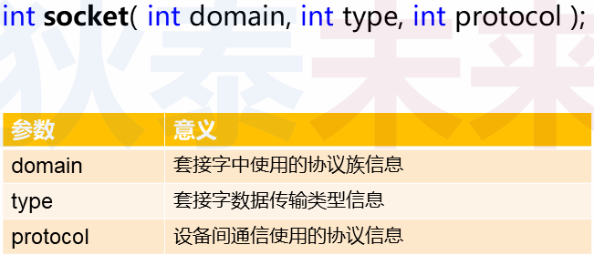
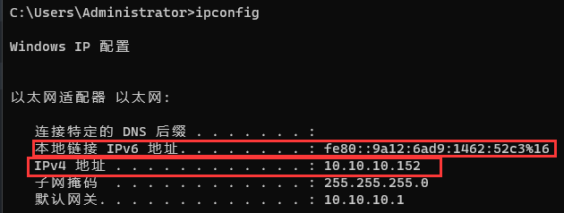
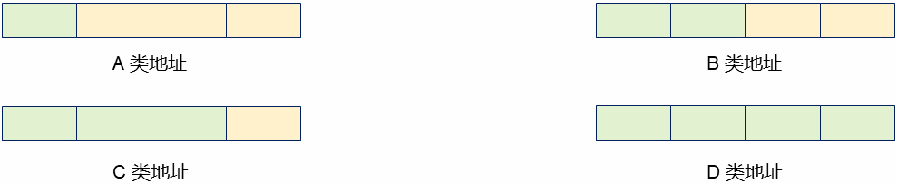
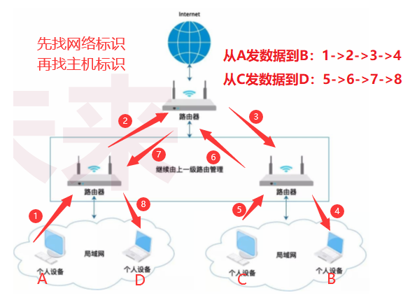
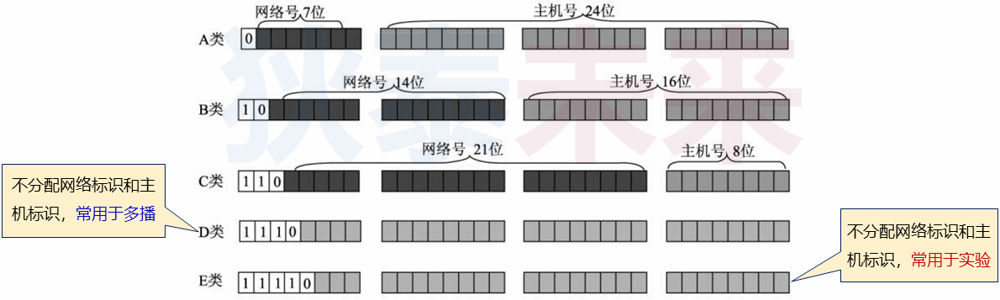
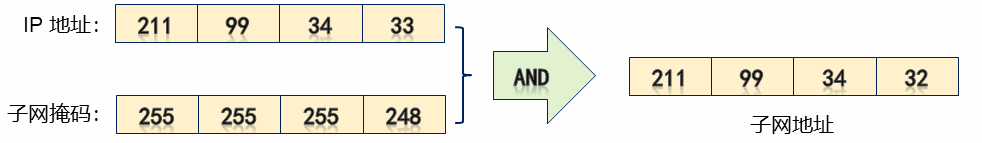

# (三) 深入浅出IP地址

❓问题 : 网络编程接口中一些参数的意义是什么?

​	`sock = socket(PF_INET,SOCK_STREAM,0)`

# 1.再论 `socket(...)`

## 1.1 `socket(...)` 参数详解

>

### 1.1.1 `socket(...)` 中的 `domain` 参数 (协议族)

>`PF_INET` -> IPV4 互联网协议族
>
>`PF_INET6` -> IPV6 互联网协议族
>
>`PF_LOCAL` -> 本地进程间通信协议族
>
>`PF_PACKET` -> 底层数据收发协议族
>
>`PF_IPX` -> Novell专用协议 (互联网分组交换协议)
>
>。。。。。。
>
>```tex
>⚠️注意:
>不同协议中的地址表现形式可能不同,
>网络编程时地址类型必须和协议类型匹配。
>```
>
>

### 1.1.2 `socket(...)` 中的 `type` 和 `protocol`

#### 1.1.2.1 `type` 

>- 用于指定协议类型
>   - `SOCK_STREAM` : 流式数据 (`TCP`)
>   - `SOCK_UGRAM` : 报文式数据 (`UDP`)

#### 1.1.2.2 `protocol` 

>- 用于指定协议族中符合类型的具体协议
>   - `domain` 和 `type` **$\color{SkyBlue}{几乎可以唯一确定一种协议}$** , 因此 , 这个参数通常为0。
>   - 即 : 0 代表 `domain` 和 `type` 指定后的默认协议。

# 2.论IP地址

## 2.1 关于端口号 和 IP 地址

>- (port) 端口号是一个2字节无符号数据
>- 0~1023作为 **$\color{red}{特定端口}$** 被预定义 (分配给特定应用程序)
>   - 某些系统 1024~2048 也被预留了 , 在编程时强行使用可能出现bind(...)失败
>   - 在选择的时候 , 尽量选择 **数值大一些** 的端口号 , 比如 : 8888 , 8899之类的
>- IP 地址是一个4字节地址族 (可分为5类地址)
>
>

## 2.2 深入解析IP地址

>- IP地址分为 **$\color{SkyBlue}{网络标识}$** 和 **$\color{red}{主机标识}$** 两部分
>  - 网络标识 : 标识网络主机 (设备) 所在的网络
>  - 主机标识 : 标识网络主机 (设备) 的具体地址
>
>- ❓问题 : 一个IP地址就4个字节,那么如何区分网络标识和主机标识呢 ?
>
>
>
>
>
>- **IP地址** 和 **子网掩码** 配合使用区分 **网络标识** 和 **主机标识**
>- **子网掩码** 的表现形式也是一个 **4字节** 的整型数
>- **子网掩码** 用于从IP地址提取 **网络标识**
>
>```tex
>tips : IP地址 和 子网掩码 通过每个字节 按位与运算 进行提取 网络标识 和 主机标识
>
>例 : IP : 192.168.15.10 ,子网掩码 : 255.255.0.0
>
>192.168.15.10
>255.255.0.0
>&
>————————————
>192.168.0.0 (网络地址)
>
>```
>
>

## 2.3 深入理解子网掩码

>- 子网掩码是一个无符号整数
>
>```tex
>设: 子网掩码为 `M.N.P.Q` , 则子网可用IP地址 n = (256 - M) * (256 - N) * (256 - P) * (256 - Q)
>
>例如 : 
>	IP地址：211.99.34.33 , 掩码 : 255.255.255.248。因此：211.99.34.33所在子网有8个 IP地址，且211.99.34.33 所在子网地址为211.99.34.32，广播地址为211.99.34.39。
>
>n = (256 - 255) * (256 - 255) * (256 - 255) * (256 - 245) = 8
>
>211.99.34.33
>255.255.255.248
>&
>————————————
>211.99.34.32
>
>最后可分配给网络设备的IP地址只有6个 ,范围 : 211.99.34.33 ~ 211.99.34.38
>因为211.99.34.32是子网的地址，211.99.34.39是广播的地址。
>
>```
>
>
>
>```tex
>可知211.99.34.33所在子网有8个IP地址,且8 = 2^3 ,所以Y = 32 - 3 = 29，此处Y的数值是高位部分（位1）所占的个数。
>
>简洁表示法:211.99.34.33/29
>
>```
>
>| bit0 | bit1 | bit2 | bit3 | bit4 | bit5 | bit6 | bit7 | bit8 | bit9 | bit10 | bit11 | bit12 | bit0 | bit0 | bit0 | bit0 | bit0 | bit0 | bit0 | bit0 | bit0 | bit0 | bit0 | bit24 | bit25 | bit26 | bit27 | bit28 | bit29 | bit30 | bit31 |
>| ---- | ---- | ---- | ---- | ---- | ---- | ---- | ---- | ---- | ---- | ----- | ----- | ----- | ---- | ---- | ---- | ---- | ---- | ---- | ---- | ---- | ---- | ---- | ---- | ----- | ----- | ----- | ----- | ----- | ----- | ----- | ----- |
>|      |      |      |      |      |      |      |      |      |      |       |       |       |      |      |      |      |      |      |      |      |      |      |      |       |       |       |       |       |       |       |       |
>
>
