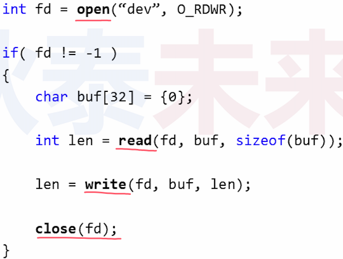
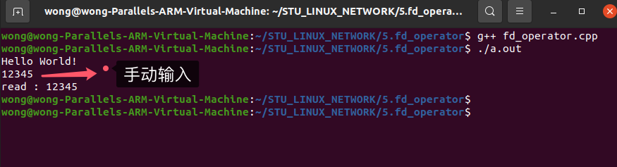
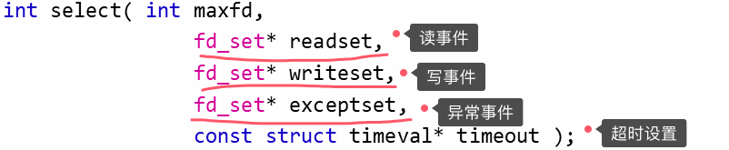
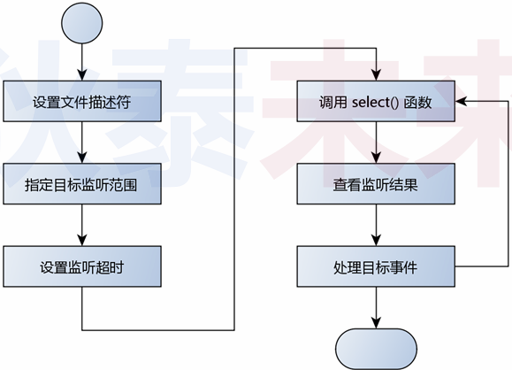
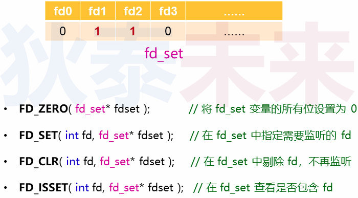
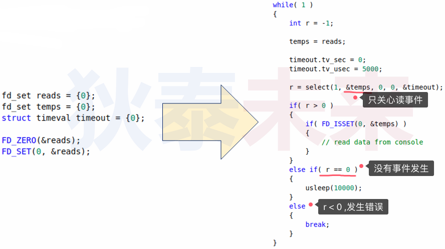
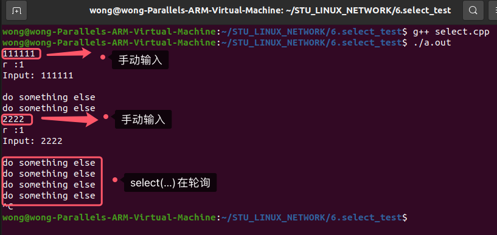

# (四) select多路复用

❓问题 : 如何增强服务端能力,同时支持多个客户端?

# 1.Linux设计哲学 : 一切皆文件

>

## 1.1 Linux 中的文件是什么?

>- 狭义：
>   - 文件系统中物理意义上的文件 (逻辑上关联的数据集合)
>- 广义：
>   - 设备 , 管道 , 内存 , 。。。
>   - Linux管理的一切对象
>

## 1.2 理解文件描述符 ( `File Descriptor` )

>- 文件描述符是一个 `非负整数值` , 本质是一个句柄
>- **$\color{red}{一切对用户 ( 程序员 ) 透明的资源标识都可以看作句柄}$**
>- 用户使用 `文件描述符` ( 句柄 ) 与内核交互
>- 内核通过 `文件描述符` ( 句柄 ) 操作对应资源的数据结构

## 1.3 一切皆文件的意义

>- 统一各种设备的操作方式 (open, read, write, close)
>- 一如 : 
>   - 10设备 (命令行 , 显示器)
>   - 网络设备 (网卡)
>

## 1.4 Linux文件操作编程模式

>

## 1.5 编程实验

>[[参考链接🔗]](https://github.com/WONGZEONJYU/STU_LINUX_NETWORK/blob/main/5.fd_operator/fd_operator.cpp)
>
>```c++
>#include <cstdio>
>#include <unistd.h>
>#include <iostream>
>
>using namespace std;
>
>int main()
>{
>    int iofd {0};
>
>    char s[] {"Hello World!\r\n"};
>
>    write(iofd,s,sizeof(s));
>
>    int len (read(iofd,s,5));
>
>    s[len] = 0;
>
>    cout << "read : " << s << '\n';
>
>    return 0;
>}
>
>```
>
>

# 2. 事件处理

## 2.1 事件相关函数的分类

### 2.1.1 阻塞式函数

>- 函数调用后需要 **$\color{red}{等待}$** 某个事件发生后才会返回
>- `read(...)` , `scanf(...)` , `accept(...)`

### 2.1.2 非阻塞式函数

> - 函数调用后能够及时返回 (**$\color{red}{仅标记等待的事件}$**)
> - 事件发生后以 **$\color{red}{回调方式}$** 传递

## 2.2 阻塞 VS 轮询

>- 轮询指依序询问每一个相关设备是否需要服务的方式
>- 轮询可用于解决阻塞函数导致程序无法继续执行的问题
>
>

# 3. 关于`select(...)`

## 3.1 `select(...)` 函数

>- `select(...)` 用于监视指定的文件描述符是否产生事件
>- 可通过轮询的方式检测目标事件 (事件产生则标记发生变化)
>- 根据事件类型做出具体处理 (如 : 读取数据)
>
>
>
>```tex
>返回值:select成功时返回就绪(可读、可写和异常)文件描述符的总数。如果在超时时间内没有任何文件描述符就绪,select将返回0。select失败时返回-1。如果在select等待期间，程序接收到信号，则select立即返回-1，并设置errno为EINTR。
>
>maxfd：参数指定的被监听的文件描述符的总数。它通常被设置为 select 监听的所
>有文件描述符中的最大值+1,因为描述符是从0开始计数的。
>
>readfds、writefds 和 exceptfds： 指向可读、可写和异常等事件对应的文件描述符集合。应用程序调用 select 函数时,通过这 3 个参数传入自己感兴趣的文件描述符。select 返回时,内核将修改它们来通知应用程序哪些文件描述符已经就绪。
>```

## 3.2 使用步骤

>

## 3.3 相关数据类型及操作

>

## 3.4 轮询示例

>

## 3.5 编程实验

>[[参考链接]](https://github.com/WONGZEONJYU/STU_LINUX_NETWORK/blob/main/6.select_test/select.cpp)
>
>```c++
>#include <sys/select.h>
>#include <sys/time.h>
>#include <cstdio>
>#include <unistd.h>
>#include <iostream>
>
>using namespace std;
>
>int main(int argc,char* argv[])
>{
>    int iofd {};
>    char s[] {"Hello World!\r\n"};
>    fd_set reads{};
>    
>    FD_ZERO(&reads);
>    FD_SET(iofd,&reads);
>
>    int counter{};
>
>    while (true){
>        
>        fd_set temps{reads};//select函数会影响temps的值，所以每次我们都需要拷贝一次以确保不会出错
>        timeval timeout{.tv_sec = 0,.tv_usec = 50000};
>
>        int r {select(1,&temps,nullptr,nullptr,&timeout)};
>
>        if (r > 0){
>
>            cout << "r :" << r << '\n';
>
>            int len (read(iofd,s,(sizeof(s) - 1)));
>
>            s[len] = 0;
>
>            cout << "Input: " << s << '\n';
>
>        }else if (0 == r){
>            usleep(1000);
>            if (++counter > 100){
>                cout << "do something else\n";
>                counter = 0;
>            }
>        }else{
>            break;
>        }
>    }
>    
>    return 0;
>}
>
>```
>
>

思考: 
使用 `select(...)` 函数可以扩展服务端功能吗 ?
如如果可以 , 具体怎么实现 ?