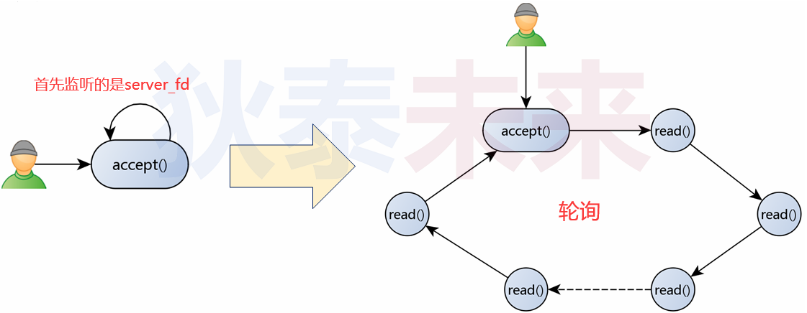
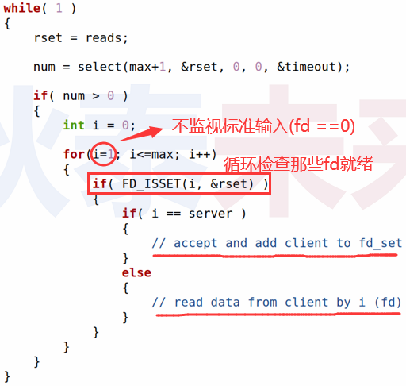
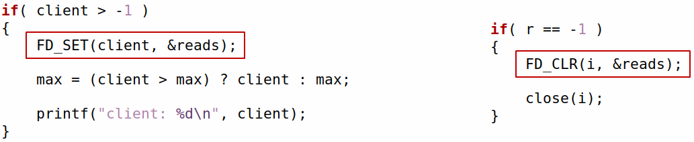

# (五) 多路复用的服务端

❓问题 : 使用 `select(...)` 函数可以扩展服务端功能吗 ? 如果可以 , 具体怎么实现 ?

# 1.目前服务端瓶颈分析

>

# 2.解决方案

## 2.1 阻塞变轮询 

>1. 通过 `select(...)` 函数 **$\color{red}{首先监听服务端}$** `server_fd` , 目标事件为 "连接" (读)
> 2. 当事件发生 (客户端连接) 则调用 `accept(...)` 接受连接
> 3. 将 `client_fd` 加入监听范围 , 目标事件为 "数据接收" (读)
> 4. **$\color{red}{循环查看}$** 各个被监听的文件描述符是否符合有事件发生

## 2.2 实现方式

>

## 2.3 实现逻辑

>

## 2.4 实现关键

>- 动态调整需要监视的文件描述符
>   - 当接收到客户端连接时 , 将客户端文件描述符加入监听变量 (`fd_set`) 中
>   - 当发现客户端断开时 , 在监听变量 (`fd_set`) 中剔除客户端文件描述符
>
>