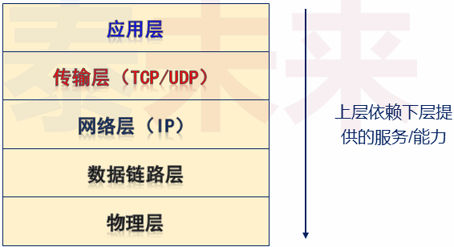
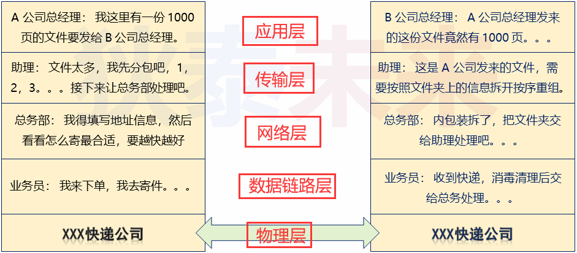
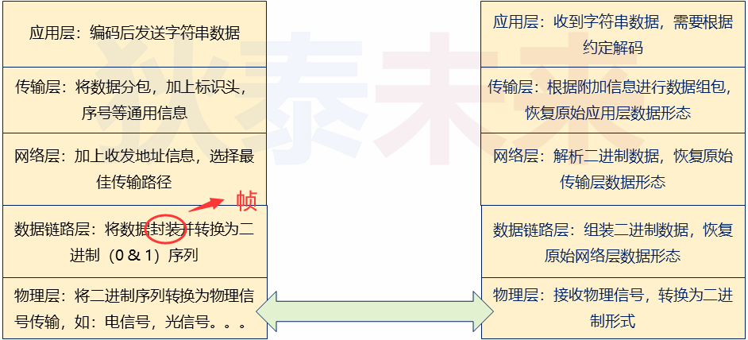
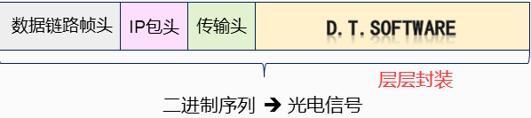

# (七) TCP与UDP

# 1. TCP

## 1.1 TCP/IP 分层结构

>
>
>TCP/IP (协议栈) 协议族
>
>- 应用层 : 各个应用程序可以定义 (使用) 各种各样的协议
>- 传输层 (TCP/UDP) : 确保发出的数据能够达到目标主机 , 完成数据传输
>- 网络层 (IP) : 填写数据包地址 , 选择数据传递路径
>- 数据链路层 : 融合不同连接方式的链路 , 屏蔽网络差异
>- 物理层 : 具体连接方式 : 有线 , 无线 , 光纤 , ...

## 1.2 TCP/IP 工作方式

>一个生活小例子
>
>
>
>
>
>| A           |                         |      B      |
>| ----------- | :---------------------: | :---------: |
>| 应用层:     |                         |   应用层:   |
>| 传输层:     |                         |   传输层:   |
>| 网络层:     |                         |   网络层:   |
>| 数据链路层: |                         | 数据链路层: |
>| 物理层:     |                         |   物理层:   |
>|             | <---------------------> |             |

1.3 TCP/IP 层次结构的特点

>上层 **$\color{red}{依赖邻接}$** 下层的能力 , 下层只为 **$\color{red}{直接邻接}$** 上层服务
>
>上层不知道下层工作机制 , 下层不管上层传输的数据内容
>
>不做跨层服务 , 层次结构的角色缺一不可
>
>

## 1.3 深入理解网络层 (IP层)

>IP寻址 : IP地址属于网络层地址 , 用于标识网络上的主机
>
>路由控制 : 控制数据如何到达目标主机 (如 : 需要经过那些路由器转发)
>
>无连接 : 数据包根据IP地址在网络上传递 (无需与目标实现建立连接)
>
>