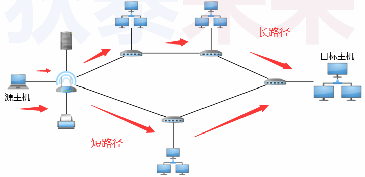

# (七) TCP与UDP

# 1. TCP

## 1.1 TCP/IP 分层结构

>
>
>TCP/IP (协议栈) 协议族
>
>- 应用层 : 各个应用程序可以定义 (使用) 各种各样的协议
>- 传输层 (TCP/UDP) : 确保发出的数据能够达到目标主机 , 完成数据传输
>- 网络层 (IP) : 填写数据包地址 , 选择数据传递路径
>- 数据链路层 : 融合不同连接方式的链路 , 屏蔽网络差异
>- 物理层 : 具体连接方式 : 有线 , 无线 , 光纤 , ...

## 1.2 TCP/IP 工作方式

>一个生活小例子
>
>
>
>
>
>| A           |                         |      B      |
>| ----------- | :---------------------: | :---------: |
>| 应用层:     |                         |   应用层:   |
>| 传输层:     |                         |   传输层:   |
>| 网络层:     |                         |   网络层:   |
>| 数据链路层: |                         | 数据链路层: |
>| 物理层:     |                         |   物理层:   |
>|             | <---------------------> |             |

1.3 TCP/IP 层次结构的特点

>上层 **$\color{red}{依赖邻接}$** 下层的能力 , 下层只为 **$\color{red}{直接邻接}$** 上层服务
>
>上层不知道下层工作机制 , 下层不管上层传输的数据内容
>
>不做跨层服务 , 层次结构的角色缺一不可
>
>

## 1.3 深入理解网络层 (IP层)

>- IP寻址 : IP地址属于网络层地址 , 用于标识网络上的主机
>- 路由控制 : 控制数据如何到达目标主机 (如 : 需要经过那些路由器转发)
>- 无连接 : 数据包根据IP地址在网络上传递 (无需与目标实现建立连接)
>- MAC地址 :
>   - **$\color{SkyBlue}{数据链路层所使用的硬件地址}$**
>   - **$\color{red}{MAC地址与网络无关 , 出厂时写入到网络设备中}$**
>
>```tex
>当主机从网络上每收到一个数据帧时,首先检查数据帧中的MAC地址。
>如果是发往本地的数据帧则收下,之后进行其他处理;否则就将此帧丢弃,不再进行其他的处理
>```
>

## 1.4 IP地址和MAC地址

>- **$\color{SkyBlue}{IP地址是动态的}$** , 不特定于某个具体的硬件 (MAC 地址隶属于具体硬件)
>- IP地址是网络层使用的地址 (用于跨网络投递数据包)
>- **$\color{red}{MAC 地址是数据链路层使用的地址}$** (用于确定目标网络中接收数据的主机)
>- 路由器中记录了本网络中主机 IP 地址与 MAC 地址的映射关系

## 1.5 IP路由控制

>- 为了将数据发送给目标主机 , 所有主机都维护者一张 **路由表** 
>   - 路由表的获取的方式 : 手动填写 , 动态创建(大多数路由器默认行为)
>- 路由表记录了IP数据包下一步应该发给哪个路由器
>
>

## 1.6 IP数据转发

>- IP数据包转发用的是 “尽力服务” 策略
>   - “尽力服务”指“努力 , 但不保证结果”
>   - 转发时会通知附加信息检查数据合法性 , 但出现异常不会进行重发
>   - 以包为单位进行转发 , 不保证到达 (发出之后 , 石沉网海)
