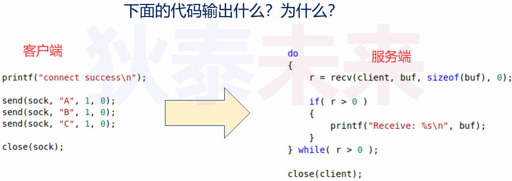
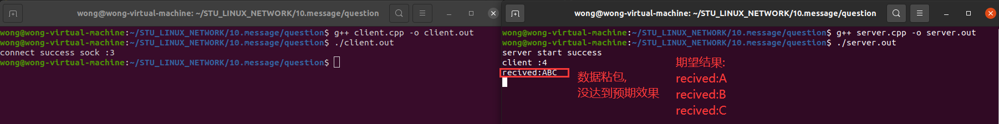
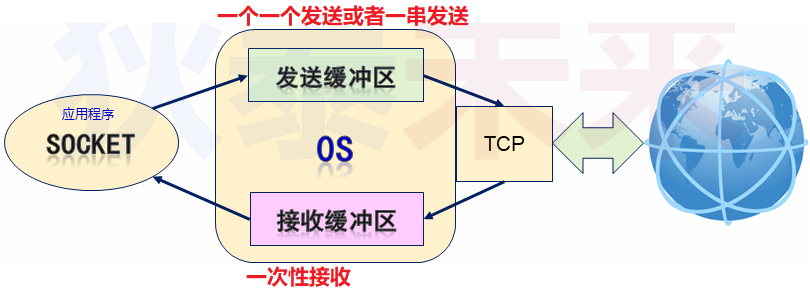
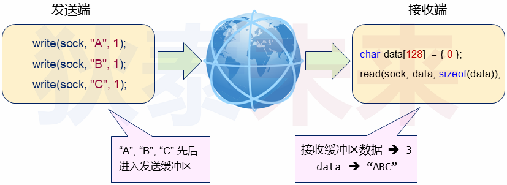

# (八) 应用层协议设计与实现

# 0.抛砖引玉

❓问题 : 下面的代码输出什么 ? 为什么 ?



编程实验 :

>[[参考链接]]()
>
>server
>
>```c++
>#include <sys/types.h>
>#include <sys/socket.h>
>#include <netinet/in.h>
>#include <arpa/inet.h>
>#include <cstdio>
>#include <unistd.h>
>#include <cstring>
>#include <iostream>
>#include <iomanip>
>
>using namespace std;
>
>int main() 
>{
>    int server {socket(PF_INET,SOCK_STREAM,0)};
>
>    if (-1 == server){
>        cout << "server socket error\n";
>        return -1;
>    }
>
>    sockaddr_in saddr {};
>
>    saddr.sin_family = AF_INET;
>    saddr.sin_addr.s_addr = htonl(INADDR_ANY);//htonl函数把小端转换成大端（网络字节序采用大端）
>    saddr.sin_port = htons(8888);
>
>    if ( -1 == bind( server,reinterpret_cast<const sockaddr *>(&saddr),sizeof(saddr) ) ){
>        cout << "server bind error\n";
>        return -1;
>    }
>
>    if ( -1 == listen(server,1) ){
>        cout << "server listen error\n";
>        return -1;
>    }
>
>    cout << "server start success\n";
>
>    while (true){
>
>        sockaddr_in caddr {};
>        socklen_t asize {sizeof(caddr)};
>
>        const int client {accept(server,reinterpret_cast<sockaddr *>(&caddr),&asize)};
>
>        if (-1 == client){
>            cout << "client accept error\n";
>            return -1;
>        }
>
>        cout << "client :" << client << '\n'; //client的数值表示系统资源的id
>
>        int r{};
>
>        do{
>            char buf[32]{};
>
>            r = recv(client,buf,(sizeof(buf)/sizeof(*buf)),0);
>
>            if (r > 0){
>                cout << buf << '\n';
>            }
>
>        } while (r > 0);
>
>        close(client);
>    }
>
>    close(server);
>
>    return 0;
>}
>```
>
>client
>
>```c++
>#include <sys/types.h>
>#include <sys/socket.h>
>#include <netinet/in.h>
>#include <arpa/inet.h>
>#include <cstdio>
>#include <unistd.h>
>#include <cstring>
>#include <iostream>
>
>using namespace std;
>
>int main(int argc, char const *argv[])
>{
>    const int sock{socket(PF_INET,SOCK_STREAM,0)};
>
>    if (-1 == sock){
>        cout << "socket error\n";
>        return -1;
>    }
>
>    sockaddr_in addr {};
>    addr.sin_family = AF_INET;
>    addr.sin_addr.s_addr = inet_addr("127.0.0.1");
>    addr.sin_port = htons(8888);
>
>    if ( -1 == connect( sock,reinterpret_cast<sockaddr *>(&addr),sizeof(addr) )){
>        cout << "connect error\n";
>        return -1;
>    }
>
>    cout << "connect success sock :" << sock << '\n';
>
>    send(sock,"A",1,0);
>    send(sock,"B",1,0);
>    send(sock,"C",1,0);
>
>    close(sock);
>    return 0;
>}
>
>```
>
>
>
>```tex
>出现这个问题,由于TCP是流式数据,无头无尾,发送和接收不对等,从而导致数据粘包问题
>```

小知识 :

>- 发送缓冲区 :
>   - 数据先进入发送缓冲区,之后由操作系统发送远端主机
>- 接收缓冲区:
>   - 远端数据被操作系统接收后放入接收缓冲区
>   - 之后应用程序从接收缓冲区读取数据
>
>

# 1. TCP 应用编程中的 "问题"

接收端无法知道数据的发送方式

>
>
>接收端无法知道 "ABC" 是分开3次进行发送

