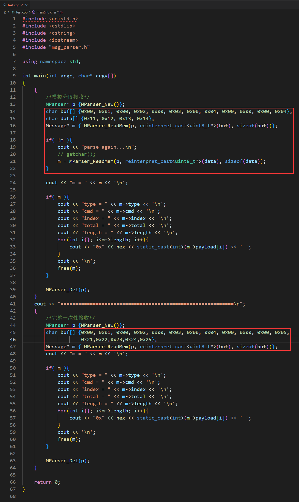
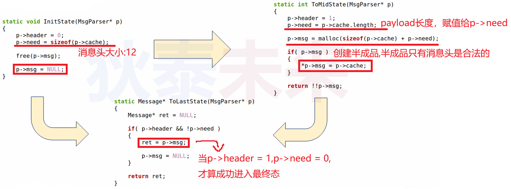

# (九) 应用层协议解析模块设计

> ❓问题 : 如何在代码层面封装协议细节 ?
> 
> ❓如何将接收缓冲区中的数据解析成 `Message` ?

# 1.从内存中解析协议数据

## 1.1深度思考

* 数据是否能够解析成功 `Message` ?
	* 数据量足够
		* 如果数据量足够 , 是否能够解析不止一个 Message ?
		* 如何处理剩余的数据 (属于下一个 `Message` ) ?
	* 数据量不足
		* 是否达到协议最小长度 (12字节) ?
		* 如何处理数据量超过最小长度 , 但不足以创建一个 Message 的情况 ?

## 1.2初步的解决方案

* **$\color{SkyBlue}{定义一个模块}$** 用于从字节流解析 `Message`
* 可 **$\color{pink}{从指定内存}$** 或 **$\color{red}{从指定文件描述符}$** 读取并解析
* 当 **$\color{SkyBlue}{至少存在12个字节}$** 时开始解析首
	1. 先解析协议中的头信息和数据区长度 (length)
	2. 根据数据区长度继续从字节流读取数据 (payload)
	3. 当协议数据解析完成时 , 创建 `Message` 并返回 , 否则 , 返回 `NULL`

## 1.3 协议解析模块的初步设计

### 1.3.1 解析器接口定义

>```c++
>#ifndef MSG_PARSER_H
>#define MSG_PARSER_H
>
>#include "message.h"
>
>using MParser = void;
>
>MParser * MParser_New();
>Message * MParser_ReadMem(MParser * parser,unsigned char * mem,unsigned int length);
>Message * MParser_ReadFd(MParser * parser,int fd);
>void MParser_Reset(MParser * parser);
>void MParser_Del(MParser * parser);
>
>#endif //MSG_PARSER_H
>```

### 1.3.2 解析器数据结构

>```c++
>struct MsgParser
>{
>int header;    //标识消息头是否解析成功
>int need;      //标识还需要多少字节才能完成解析(初始化状态是标识需多少个字节才能解析出固定部分)
>Message * msg;      //解析中的协议消息(半成品)
>Message cache;      //缓存已解析的消息头
>};
>```

 

## 1.4 从内存中解析协议数据(设计细节)

### 1.4.1 条件 : 内存长度至少连续 **12** 个字节

 

### 1.4.2 从内存中读取 payload 中的数据 (可多次读取)

 

### 1.4.3 编程实验

[[参考代码]](https://github.com/WONGZEONJYU/STU_LINUX_NETWORK/tree/main/11.msg_parser/first_edition)

 

 

 

 

>```tex
>tips:
>在11.msg_parser/first_edition下
>mkdir build -> cd build -> cmake .. -> make
>生产test可执行文件
>```

#### 1.4.3.1 存在一个问题

 

 

 

>```tex
>⚠️ buf的字节序是按照网络字节序填写的
>```

>❓思考 : 如何通过socket 文件描述符 **$\color{red}{实时解析协议消息}$** ?

# 2.从文件描述符解析协议数据

>❓思考 : 如何通过socket 文件描述符 **$\color{red}{实时解析协议消息}$** ?

## 2.1 深度思考

>❓是否一定等到数据量足够 (如 : 消息头12直接) 才能开始解析.

>❓从文件描述符是否能够获取足够的数据 ?

* **$\color{SkyBlue}{数据量足够}$**
	* 读取12直接解析消息头
	* 读取数据填充 payload (length)
* **$\color{red}{数据量不足}$**
	* 无法获取消息头所数据 (如何处理 ? 解析状态如何切换 ? )
	* 无法获取payload 完整数据 (如何处理 ? 是否可追加 ? )

## 2.2 解决方案

* 策略 : 尽力获取数据 , 实时解析
	* 即便当前获取1字节 , 也可根据状态进行解析
	* 支持不同数据源多次接力解析 (从内存或者文件描述符交替获取数据)
* 关键 : 充分利用解析器状态信息是实现解决方案的关键

## 2.3 解析器状态切换

 

## 2.4 状态切换函数

 

>```tex
>⁉️什么时候调用上面这些函数和在什么地方调用,才是最关键!!!
>```

## 2.4 从文件描述符中...

### 2.4.1 从文件描述符中获取数据

 

>```tex
>同理,什么时候和在哪里调用才是关键!!!
>```

### 2.4.2 从文件描述符中实时解析消息头

 

### 2.4.3 从文件描述符中获取payload数据

 

## 2.5 编程实验

[[参考链接msg_parser.h/cpp]](https://github.com/WONGZEONJYU/STU_LINUX_NETWORK/tree/main/11.msg_parser/second_edition)

[[memtest测试参考]](https://github.com/WONGZEONJYU/STU_LINUX_NETWORK/tree/main/11.msg_parser/second_edition/mem_test)

[[fd_test测试参考]](https://github.com/WONGZEONJYU/STU_LINUX_NETWORK/tree/main/11.msg_parser/second_edition/network_test)

 

 

### 2.5.1 从内存中解析

 

 

>```tex
>git下来后,编译需要在second_edition/mem_test/目录下
>mkdir build -> cd build -> cmake .. -> make
>生成可执行memtest
>```

### 2.5.2 从文件描述符中解析

 

 

 

 

 

>```tex
>tips:
>git下来后,编译需要在second_edition/network_test/目录下
>mkdir build -> cd build -> cmake .. -> make
>生成可执行文件server 与 client
>```

>❓思考 : 有了协议和协议解析器之后,可以干嘛?
